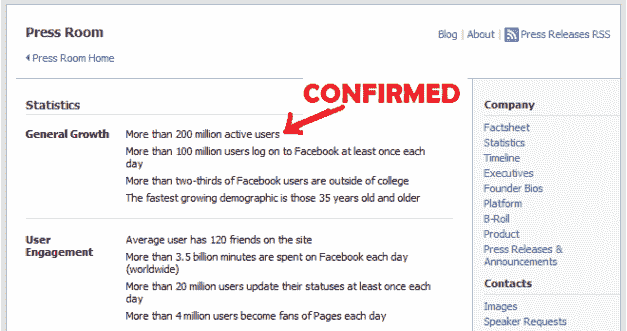
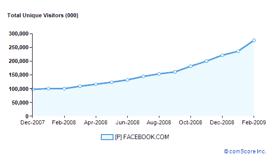
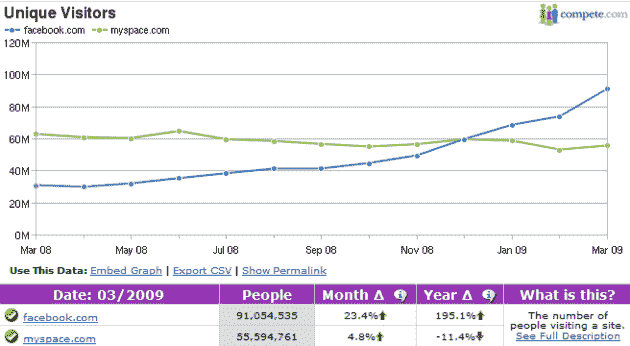

# 扎克伯格承认脸书现在有 2 亿用户

> 原文：<https://web.archive.org/web/https://techcrunch.com/2009/04/08/zuckerberg-welcomes-200-millionth-facebook-user-wants-to-know-how-it-affected-your-life/>

# 扎克伯格承认脸书现在有 2 亿用户

 脸书首席执行官[马克·扎克伯格](https://web.archive.org/web/20230130113936/http://www.crunchbase.com/person/mark-zuckerberg)刚刚在公司博客上发布了一条消息，确认了社交网络服务的用户数量，该服务已经在[流传了一段时间](https://web.archive.org/web/20230130113936/http://www.allfacebook.com/2009/03/facebook-200-million/)。这篇名为[‘2 亿人口’](https://web.archive.org/web/20230130113936/http://blog.facebook.com/blog.php?post=72353897130)的博文称，这个里程碑将在今天有效实现(不需要更多的猜测，只需要卢森堡的全部人口)。

扎克伯格继续谈论这项服务如何通过让信息共享变得更容易来帮助改变世界。，但当他嵌入一段显示脸书自 2004 年以来增长的热图视频时，又变得有趣起来，这段视频描绘了世界各地的人们在网络上连接的速度。

不幸的是，它只能在脸书观看和分享，但是这里有一个[到视频](https://web.archive.org/web/20230130113936/http://www.facebook.com/video/video.php?v=71196792074)的直接链接。

**更新:**开始了(就像变魔术一样):

[http://www.facebook.com/v/71196792074](https://web.archive.org/web/20230130113936/http://www.facebook.com/v/71196792074)

马克·扎克伯格还指出了“脸书为善”的一个新的个人资料页面，该页面致力于将所有来自脸书用户的故事归类为“关于脸书如何帮助他们回馈社区、实现改变或与远房亲戚联系的故事”

脸书的增长保持着惊人的速度。今年 1 月份[官方用户数](https://web.archive.org/web/20230130113936/http://www.facebook.com/press/info.php?timeline)仍为 1.5 亿，2 月份增至 1.75 亿。这意味着仅在 2009 年到目前为止，就有惊人的 5000 万人注册了这个社交网络(或每天 50 万人，超过了卢森堡的总人口)。

根据最近的全球 comScore 数据，上个月底，我们报道说它的流量也在飙升。数据还显示，2009 年 2 月，超过四分之一的互联网用户访问了脸书，相当于每月 2.76 亿独立访客(是 MySpace 全球流量的两倍多)。

像往常一样， [Compete 的流量数据](https://web.archive.org/web/20230130113936/http://siteanalytics.compete.com/facebook.com+myspace.com/?metric=uv)描绘了两家公司游客数量下降的画面，但报告了类似的趋势。

