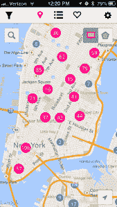

# Zumper 走向全国，发布了一款 iPhone 应用程序，帮助你找到下一个公寓 

> 原文：<https://web.archive.org/web/http://techcrunch.com/2013/08/15/zumper-goes-national-and-releases-consumer-facing-iphone-app-to-help-you-find-your-next-apartment/>

在推出并成为 TechCrunch Disrupt 决赛入围者大约一年后，公寓租赁初创公司 [Zumper](https://web.archive.org/web/20230129060530/https://www.zumper.com/) 正在扩展到纽约市、旧金山和芝加哥以外的地区，并正在走向全国。除了用户能够找到房源的所有新地方，它还推出了一款 [iPhone 应用](https://web.archive.org/web/20230129060530/https://itunes.apple.com/us/app/zumper-find-your-next-home/id678683201?mt=8)，旨在帮助租房者找到他们的下一套公寓。

对于那些可能已经忘记的人，Zumper 推出了一个平台，以简化房地产经纪人和公寓经理列出和管理可用公寓的方式。然后[增加了专业功能](https://web.archive.org/web/20230129060530/https://techcrunch.com/2013/02/28/vc-backed-disrupt-alum-zumper-jumps-into-the-chicago-rentals-market-builds-out-pro-features/)和[为房地产专业人士推出了一款 iPhone 应用](https://web.archive.org/web/20230129060530/https://techcrunch.com/2013/04/25/zumper-pro-iphone/)，帮助他们为自己的公寓即时创建漂亮的房源。

现在，它准备用一款专门针对消费者的 iPhone 应用程序将租房者与这些房源联系起来。

 新的 Zumper iPhone 应用程序为用户提供了搜索和发现通过其平台列出的房产所需的所有工具。他们可以扫描附近房产的地图，根据位置搜索公寓，也可以按社区搜索。例如，对于旧金山挑剔的租房者来说，你可以选择只看位于米申、卡斯特罗或诺伊山谷地区的公寓。

一旦你缩小了可接受的居住范围，你就可以根据价格、卧室数量、最近的空间列表以及是否接受宠物来进一步细化你的搜索。这会给你一个符合你的标准的地方列表，你可以查看单个列表页面来了解更多关于公寓或房产本身的信息。

找到你喜欢的东西了吗？你可以收藏一个列表，也可以通过电子邮件、短信或 Twitter 分享。你也可以在应用程序中直接向租赁公司发送消息，这将加快获得回复的时间，并可能加快你最终找到公寓的时间。

首席执行官安泰莫斯·乔治迪斯(Anthemos Georgiades)表示，这也是 Zumper 最初想开发一款面向消费者的 iPhone 应用的部分原因:它想关闭房地产专业人士和潜在租户之间的移动通信环路。由于双方都是移动用户，双方都不必等着回到电脑前去联系或预约。

由于所有房源都来自其自己的管理平台，在 Zumper 应用程序中找到的公寓是准确和最新的，至少在可用性方面是如此，这不是你上周在 Craigslist 广告中可以说的。也就是说，虽然 Zumper 在其运营的城市中有很多列表，Craigslist 会有更多——但你必须与 Craigslist 打交道。

随着 iPhone 应用程序的推出，它也在全国范围内扩展，使公寓业主和潜在租户能够在美国的任何地方进行联系。虽然它以前只专注于纽约市、旧金山和芝加哥，但现在它将目标锁定在美国 1 亿多的公寓租赁市场。

Zumper 已经从众多投资者那里筹集了总计 170 万美元的种子资金，其中包括 Kleiner Perkins、Andreessen Horowitz、Greylock、CrunchFund、NEA、Dawn Capital、实验基金和 DeWilde 家庭信托。

==

***披露:**你能相信吗，这是我今天第二次不得不指出，无论是克朗彻基金还是迈克尔·阿灵顿都没有付钱给我，也没有告诉我该写些什么？*