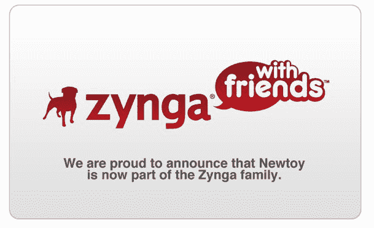

# Zynga 收购手机游戏开发商 Newtoy 

> 原文：<https://web.archive.org/web/https://techcrunch.com/2010/12/02/zynga-buys-mobile-gaming-developer-newtoy/>

# Zynga 收购手机游戏开发商 Newtoy

社交游戏巨头 Zynga 度过了重要的一周。公司昨晚推出了一款新游戏city ville；[日本出道 FarmVille](https://web.archive.org/web/20221007124254/https://beta.techcrunch.com/2010/11/30/zyngas-farmville-heads-to-the-land-of-the-rising-sun/)；并且[与美国运通](https://web.archive.org/web/20221007124254/https://beta.techcrunch.com/2010/11/30/american-express-now-lets-you-swap-rewards-points-for-zyngas-purple-cows/)联手，允许持卡人用积分兑换虚拟商品。今天 Zynga [在与媒体的电话会议上宣布公司已经收购了德克萨斯州的游戏公司](https://web.archive.org/web/20221007124254/http://www.businesswire.com/news/home/20101202006276/en/Zynga-Acquires-%E2%80%9CWords-Friends%E2%80%9D-Developer-Newtoy) [Newtoy。这笔交易的条款没有披露。*更新中。*](https://web.archive.org/web/20221007124254/http://newtoyinc.com/wp/)

Newtoy 由 Paul 和 David Bettner 兄弟创建，已经开发了许多热门的 iPhone 应用程序，包括与朋友下棋、与朋友聊天。《朋友的话》已经被下载了 1200 万次。

Zynga 移动负责人 David Ko 表示，Newtoy 将成为 Zynga 在德克萨斯州的“与朋友”办公室。Newtoy 首席执行官兼联合创始人保罗·贝特纳将担任 Zynga 与朋友工作室的副总裁兼总经理，大卫·贝特纳将成为工作室主任。

Ko 还分享了一些关于 Zynga 当前移动使用情况的有趣统计数据。iPhone 版 Farmville 仅在五个月内就有 700 万次下载，每月有 1000 万人通过移动设备访问 Zynga。

仅在今年，Zynga 就收购了北京的 [XPD](https://web.archive.org/web/20221007124254/https://beta.techcrunch.com/2010/05/20/zynga-enters-asia-with-acquisition-of-gaming-startup-xpd-media-opens-office-in-beijing/) ，东京的 [Unoh Games](https://web.archive.org/web/20221007124254/https://beta.techcrunch.com/2010/08/05/zynga-confirms-unoh-acquisition/) ，波士顿的 [Conduit Labs](https://web.archive.org/web/20221007124254/https://beta.techcrunch.com/2010/08/17/zynga-buys-bostons-conduit-labs/) ，德国法兰克福的[葡萄糖股份公司](https://web.archive.org/web/20221007124254/https://beta.techcrunch.com/2010/09/24/zynga-continues-international-expansion-buys-german-game-engine-developer-dextrose-ag/)，奥斯汀的[挑战游戏](https://web.archive.org/web/20221007124254/https://beta.techcrunch.com/2010/06/04/sec-filing-suggests-zynga-paid-at-least-20-5-million-for-challenge-games/)，得克萨斯的[篝火工作室。](https://web.archive.org/web/20221007124254/https://beta.techcrunch.com/2010/10/05/zyngas-shopping-spree-continues-buys-video-game-developer-bonfire-studios/)

Zynga [目前有](https://web.archive.org/web/20221007124254/https://beta.techcrunch.com/2010/11/15/zynga-stats-dog-activated/) 10 款主要游戏，全球有 3.2 亿人玩过 Zynga 游戏。

