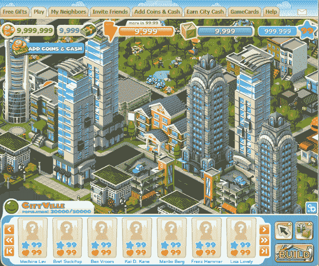

# Zynga 的 CityVille 一夜之间跃入大都市(惊讶吗？)

> 原文：<https://web.archive.org/web/http://techcrunch.com/2010/12/06/zynga-cityville-stats/>

# Zynga 的 CityVille 一夜之间跃入大都市(惊讶吗？)

上周晚些时候，Zynga 发布了最新的旗舰游戏《T2 城》，这肯定会吸引数百万狂热的粉丝。这款游戏代表了 Zynga 进入了非常受欢迎(而且已经非常拥挤)的城市建设领域，其中还包括数字巧克力的百万富翁之城，以及 Playfish、Crowdstar 和 Playdom 的竞争产品。但 Zynga 把这归结为一门科学，它起步较晚并没有阻止 CityVille 迅速获得大量用户。

Zynga 报道，在游戏的前 24 小时，超过 29 万人玩 CityVille。这比 Zynga 的最后一个标题, [FrontierVille](https://web.archive.org/web/20230202220625/https://techcrunch.com/2010/06/09/zynga-frontierville-farmville/) 在头 24 小时看到的 116，000 人增加了一倍多。FrontierVille 也不逊色——它现在每天有 650 万玩家，每月有 29872423 个活跃用户。

Zynga 表示，CityVille 是其迄今为止最大的一次发布。这种快速增长的部分原因可能是因为这是 Zynga 的首次全球发布——该游戏同时以英语、德语、意大利语、西班牙语和法语上线。

大约三周前，我们在 CityVille 进行了一次全面的测试(计划在 11 月中旬发布)，但 Zynga 决定推迟游戏，以便在发布前做一些最后的调整。看起来延迟没什么大不了的。

另一件需要注意的重要事情是:Zynga 表示，这 29 万个初始安装主要是“有机”的——它们大多来自分享状态更新和邀请朋友的玩家。Zynga 表示，它尚未启动跨游戏营销，这种营销最终将推广到其他热门游戏，如 FarmVille 和 FrontierVille。当它这样做的时候，预计会看到 CityVille 的用户数量(再次)激增。

以下是 Zynga 发送的其他一些统计数据:

> 已经建造了 270 万套住宅
> 
> 已经建造了 50 多万个面包店
> 
> 已经铺设了 500 万段道路
> 
> 25%的玩家在朋友的游戏板建立了特许经营

