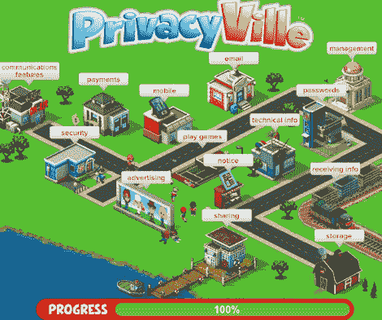

# Zynga 将隐私教育、游戏和奖励与 Privacy ville TechCrunch 结合在一起

> 原文：<https://web.archive.org/web/http://techcrunch.com/2011/07/07/zynga-combines-privacy-education-gaming-and-rewards-with-privacyville/>

# Zynga 将隐私教育、游戏和奖励与 PrivacyVille 结合在一起

对于任何公司来说，提前解决产品的隐私问题都是产品开发的重要组成部分。不幸的是，脸书付出了惨痛的代价才明白这一点。社交游戏巨头 Zynga 今天推出了名为 [PrivacyVille 的新隐私计划，增加了一层透明度。](https://web.archive.org/web/20230203083648/http://www.zynga.com/privacy/)

在典型的 Zynga 时尚中，PrivacyVille 不是普通的枯燥的隐私教育课程，而是一个类似游戏的教程，在 [RewardVille](https://web.archive.org/web/20230203083648/https://techcrunch.com/2011/03/14/rewardville-lets-you-earn-points-across-zyngas-ten-social-games/) 中奖励玩家公司的虚拟货币 zPoints，以了解更多关于 Zynga 的隐私做法。

这个游戏实际上是模仿 CityVille 设计的，所以玩家在游戏机制上有一种如梦如幻的感觉。你在一个小镇开始游戏，并在镇上旅行，了解更多关于 Zynga 隐私政策的重要部分，以及关于控制你的在线信息的资源。例如，当你开始玩游戏时，Zynga 告诉你，为了将你与在脸书上玩游戏的其他人联系起来，它会从你的脸书个人资料中获取信息，如你的姓名、照片和朋友，以使这些游戏变得更加社交化。

另一个隐私教程涉及通知手机游戏玩家 Zynga 将捕获你的设备 ID 和 IP 地址。Zynga 表示，他们和广告商可能会从你的浏览行为中收集 cookies，该公司使用你的电子邮件地址来发送警报，虽然脸书处理虚拟商品的大部分支付，但 Zynga 正在使用传输技术来确保你的支付信息是安全的。Zynga 在镇上总共有 14 个区域提供各种隐私通知。

阅读完所有通知后，您将接受一个包含五个问题的小测验，并被带到奖励村兑换您的积分。此外，你不需要连接到脸书或注册为 Zynga 玩家来游览 PrivacyVille。然而，如果你是 Zynga 的玩家，你可以选择连接到 Zynga 的 RewardVille，并申请可以用来兑换独特虚拟物品的 zPoints。顺便说一句，你可以尽情地玩隐私城，但是你只能得到一次奖励。

Zynga 表示，PrivacyVille 并不打算取代其隐私政策或隐私中心，而只是一种更具吸引力的方式来解释该公司的隐私互动。

Zynga 的总法律顾问 Reggie Davis 谈到这项新举措时说:*我们知道人们对让隐私政策变得更加平易近人很感兴趣。我们想从我们的游戏 DNA 中提取一页来创建一个可访问的、社交的和有趣的隐私教程。我们期待听到玩家对我们如何让他们更容易了解我们的政策的反馈。*

这无疑是 Zynga 的明智之举。随着公司的发展，减少这些隐私问题是很重要的。正如该公司在上周提交给 [S-1 的 IPO 文件](https://web.archive.org/web/20230203083648/https://techcrunch.com/2011/07/01/zynga-files-for-1-billion-ipo/)中透露的那样，隐私监管和脸书共享是 Zynga 未来面临的[挑战](https://web.archive.org/web/20230203083648/https://techcrunch.com/2011/07/01/zynga-files-for-1-billion-ipo/)。事实上，脸书和 Zynga 去年都因侵犯隐私而被起诉。Zynga 提供虚拟货币作为激励的事实应该可以防止隐私倡议被忽视。

