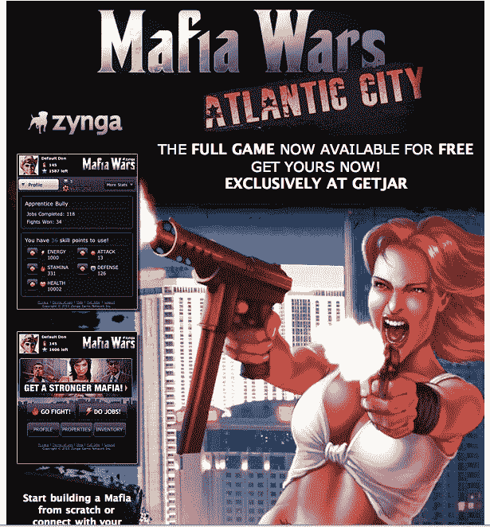

# Zynga 推出首款手机网络浏览器游戏黑手党战争大西洋城 

> 原文：<https://web.archive.org/web/http://techcrunch.com/2010/12/20/zynga-debuts-first-mobile-web-browser-game-mafia-wars-atlantic-city/>

# Zynga 推出首款手机网络浏览器游戏《黑手党战争:大西洋城》

众所周知，Zynga 在移动领域下了大赌注，最近[收购了移动应用开发商 Newtoy、](https://web.archive.org/web/20230203153728/https://techcrunch.com/2010/12/02/zynga-buys-mobile-gaming-developer-newtoy/)并为 [iPad](https://web.archive.org/web/20230203153728/https://techcrunch.com/2010/10/21/zynga-brings-farmville-to-the-ipad/) 和 [iPhone](https://web.archive.org/web/20230203153728/https://techcrunch.com/2010/06/23/farmville-iphone/) 推出了本地 Farmville 应用。事实上，截至本月早些时候，iPhone 版 Farmville 已经有 700 万次下载，每月有 1000 万人通过移动设备访问 Zynga。今天，Zynga 推出了其第一款为移动网络设计的游戏:黑手党战争大西洋城。

据该公司称，这款游戏采用 HTML5 制作，专门设计用于基于浏览器的智能手机或设备，包括 iPad、iPhone、Android、黑莓和 WebOS 设备。黑手党战争大西洋城可以通过将你的移动网络浏览器指向 M.MafiaWars.com 或 GetJar 获得。

Zynga 对 HTML5(相对于 Flash)的押注也值得一提，它允许游戏在 iPads 和 iPhones 上运行。游戏巨头最近[收购了葡萄糖股份公司](https://web.archive.org/web/20230203153728/https://techcrunch.com/2010/09/24/zynga-continues-international-expansion-buys-german-game-engine-developer-dextrose-ag/)，后者[开发了基于 HTML5 的](HTML5%20engine)开发引擎。

Zynga 曾让前雅虎高管大卫·柯(David Ko)担任其移动业务 SVP，最近还宣布 Zynga Poker 将于本周登陆安卓手机。《黑手党战争》上周与说唱歌手 Dr.Dre 合作推出了一部重要的音乐作品。

正如 Ko [几周前在 LeWeb 对 TechCrunch 的 MG Siegler](https://web.archive.org/web/20230203153728/https://techcrunch.com/2010/12/09/zyngas-cityville-game-already-at-3-million-daily-active-users-le-web/) 所说的那样，*移动对我们来说是一个巨大的机会。我们有庞大的用户群可以利用，他们有一些真正令人兴奋的 IP。敬请关注。*