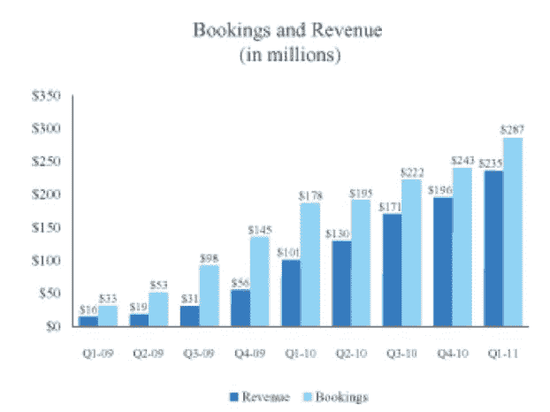

# Zynga 的财务状况:去年收入增长 392%，达到 6 亿美元 TechCrunch

> 原文：<https://web.archive.org/web/http://techcrunch.com/2011/07/01/zynga-financials/>

Zynga 终于在今天[申请了在](https://web.archive.org/web/20230203162901/https://techcrunch.com/2011/07/01/zynga-files-for-1-billion-ipo/)的首次公开募股，现在我们可以看看它的[财务状况](https://web.archive.org/web/20230203162901/http://www.sec.gov/Archives/edgar/data/1439404/000119312511180285/ds1.htm#toc198836_8)。总体而言，该公司去年实现了近 6 亿美元的收入和 9000 万美元的利润。它以令人难以置信的速度增长，2010 年的收入增长了 392%，高于 2009 年的 1.215 亿美元(高于 2008 年的 1900 万美元)。

仅在 2011 年第一季度，该公司的收入就达到了 2.35 亿美元(或 9.4 亿美元的收入增长率)，比 2010 年第一季度增长了 134%。所有这些收入增长数字中特别令人惊讶的是，从 2010 年 7 月开始，Zynga 开始向脸书支付所有脸书信用相关收入的 30 %,而且几乎没有跳过一拍。季度收入增长从 2010 年第三季度的 32%放缓至 2010 年第四季度的 15 %,但随后在 2011 年 Q1 再次加速增长至 20%。

对投资者来说，好消息是 Zynga 实际上是盈利的。在 2009 年亏损 5300 万美元后，2010 年净利润达到 9000 万美元。2011 年第一季度利润增长了 84 %,达到 1180 万美元。

Zynga 几乎所有的钱都来自虚拟商品的销售(占 Q1 2011 年收入的 95%)，其余的是广告。第一季度广告收入增长 321%，达到 1300 万美元，而在线游戏收入增长 127%，达到 2.22 亿美元。

Zynga 还报告了一项非 GAAP(公认会计准则)指标，称之为预订。从这个意义上说，它加入了 Groupon 等最近净 IPO 申报者的行列，后者也提出了自己的非 GAAP 收入衡量标准。在 Zynga 的例子中，预订让它看起来更大。例如，2010 年的总预订量为 8.389 亿美元，比其 5.975 亿美元的收入高出 40%。

Zynga 推迟确认其所有收入，这实际上是一种更保守的会计方法，是一种 godo 的事情。但是它仍然想得到它本可以让 T8 识别的信用，所以它也报告预订。这有点像 Zynga 在财务状况上自我标榜的一种方式。

以下是 Zynga 对 S-1 预订的解释:

> 预订是一项非 GAAP 财务指标，我们将其定义为在我们的在线游戏和广告中销售虚拟商品的总收入，如果我们在销售时立即确认所有收入，则该收入将在一段时间内得到确认。我们将虚拟物品的销售记录为递延收入，然后在购买的虚拟物品的估计平均寿命期间或虚拟物品被消费时确认收入。

广告收入也以同样的方式处理。

投资者希望关注的其他一些关键指标(所有数据截止到 2011 年 3 月 31 日):

*   Q1 总收入:2.354 亿美元
*   在线游戏收入:2.224 亿美元
*   在线广告收入:1300 万美元
*   现金及现金等价物:9.96 亿美元
*   运营现金流:1.03 亿美元
*   融资活动产生的现金流:2.25 亿美元
*   日活跃用户:6200 万
*   月活跃用户:2.36 亿
*   每月独立用户:1.46 亿
*   员工人数:2268 人

活跃用户和唯一用户之间的区别在于，活跃用户是按游戏计数的，而唯一用户可能玩不止一个游戏。换句话说，活跃用户是有重叠的。2011 年 3 月，1.46 亿人玩过一个或多个 Zynga 游戏。因此，Zynga 每季度每名用户的收入约为 1.60 美元。

Zynga 在 Q1“融资活动”的现金流是经营活动的两倍，这很有意思。在文件中，Zynga 披露，它在第一季度出售了价值 2.872 亿美元的有价证券，主要与该季度筹集的 4.85 亿美元融资有关(但它在同一时期还回购了价值 2.61 亿美元的股票)。
