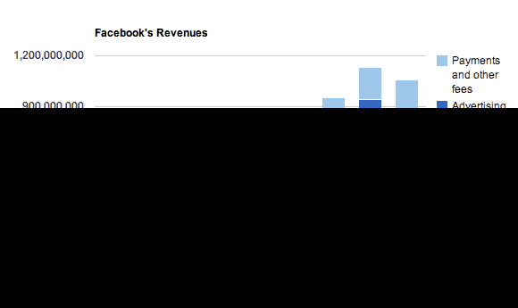

# Zynga 为脸书在 Q1 的收入贡献了 15%,低于一年前的 19%

> 原文：<https://web.archive.org/web/https://techcrunch.com/2012/04/23/zynga-made-up-15-of-facebooks-revenue-in-q1-down-from-19-a-year-ago/>

# Zynga 为脸书在 Q1 的收入贡献了 15%，低于一年前的 19%

Zynga 和脸书正试图逐渐分离开来。它在工作——算是吧？

脸书今天表示，其第一季度收入的 15%来自广告或与 Zynga 游戏相关的支付。*低于去年同期的 19%。

15%的收入中，约有 11%来自脸书从平台上 Zynga 游戏的交易或 Zynga 直接向脸书支付的广告中获得的 30%的收入份额。另外 4%来自 Zynga 内容旁边的广告。

脸书继续强调，两家公司之间的任何嫌隙都可能损害财务业绩。 [Zynga 最近彻底改造了它的网站，使之成为一个网络游戏目的地](https://web.archive.org/web/20221208003956/https://beta.techcrunch.com/2012/03/01/zynga-uses-facebook-to-launch-a-new-platform-for-its-games-and-for-other-developers/)，它希望借此吸引脸书画布之外的用户。然而，社交网络仍然为该网站的支付提供动力，这意味着 Zynga 仍然向脸书支付其 30%的股份。

“Zynga 可能会选择尝试将用户从现有的脸书整合游戏转移到其他网站或平台，”脸书在首次公开募股的最新文件中表示。“我们可能无法与 Zynga 保持良好关系，或者 Zynga 可能会决定减少或停止对 Facebook 平台上游戏的投资。如果由于这些或其他原因，Zynga 游戏在我们平台上的使用量下降，我们的财务业绩可能会受到不利影响。”

总体而言，脸书的支付和收费收入从一年前的 9400 万美元增至 1.86 亿美元，几乎是一年前的两倍。它占脸书总收入的 17.6%，高于去年第一季度的 12.9%。但这并不是一个完美的比较，因为脸书对画布上交易的 30%的收入份额只是在去年 7 月才成为强制性的。支付和费用收入也基本持平。

* **注意:**几个月前，当脸书首次申请首次公开募股时，有一个 12%的数字被广泛报道。但这只是 Zynga 在脸书 2011 年全年收入中所占的份额，还不包括 Zynga 游戏旁边其他公司购买的广告。

如果你想亲自阅读，下面是具体的内容:

> 在 2011 年和 2012 年第一季度，我们估计高达 19%和 15%的收入分别来自 Zynga 的支付处理费、Zynga 的直接广告以及 Zynga 应用程序生成的页面上显示的第三方广告收入。如果 Zynga 不能保持其与用户的互动水平，或者如果我们不能成功地维持与 Zynga 的关系，我们的财务结果可能会受到损害。
> 
> 在 2011 年和 2012 年第一季度，Zynga 分别直接占我们收入的大约 12%和 11%,其中包括来自 Zynga 销售虚拟商品的支付处理费和 Zynga 购买的直接广告的收入。此外，Zynga 的应用程序生成页面，我们在这些页面上展示来自其他广告商的广告；对于 2011 年和 2012 年第一季度，我们估计这些广告的展示分别为我们带来了约 7%和 4%的额外收入。Zynga 最近在自己的网站和非脸书平台上推出了游戏，Zynga 可能会选择尝试将用户从现有的脸书集成游戏迁移到其他网站或平台。我们可能无法与 Zynga 保持良好的关系，或者 Zynga 可能会决定减少或停止对 Facebook 平台上游戏的投资。如果我们平台上 Zynga 游戏的使用因这些或其他原因而下降，我们的财务业绩可能会受到不利影响。

*今日起更多脸书大新闻:*

[脸书修正后的 S-1:9.01 亿用户，5 亿移动用户，为 Instagram 支付了 3 亿美元现金+2300 万股股票](https://web.archive.org/web/20221208003956/https://beta.techcrunch.com/2012/04/23/facebooks-amended-s-1-500-million-mobile-users-paid-300m-cash-23-million-shares-for-instagram/)

[脸书以 5.5 亿美元现金从微软手中购买 AOL 专利](https://web.archive.org/web/20221208003956/https://beta.techcrunch.com/2012/04/23/aols-new-patent-owners-facebook-in-a-550m-deal-with-microsoft/)

[脸书没有收买雅虎，而是建立了一个拥有 1400 项专利的强大堡垒](https://web.archive.org/web/20221208003956/https://beta.techcrunch.com/2012/04/23/facebook-patent-fortress/)

[脸书平均每季度收入 1.21 美元](https://web.archive.org/web/20221208003956/https://beta.techcrunch.com/2012/04/23/your-are-worth-4-84/)