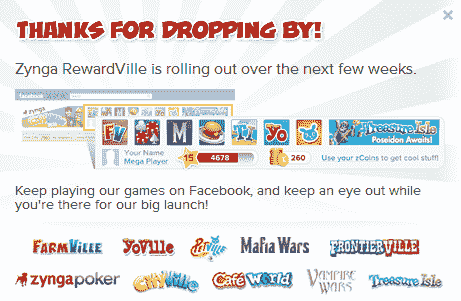
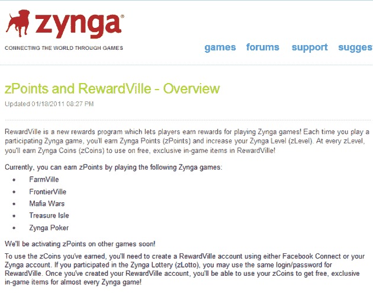
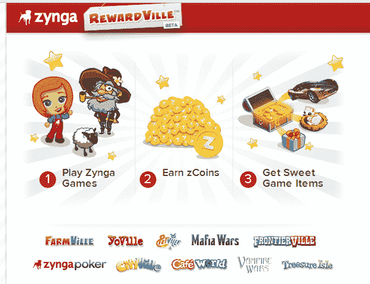

# Zynga 准备推出 RewardVille:玩游戏获得奖励 

> 原文：<https://web.archive.org/web/http://techcrunch.com/2011/01/19/zynga-rewardville/>

# Zynga 准备推出 RewardVille:通过玩游戏获得奖励

[Zynga](https://web.archive.org/web/20230202232025/http://www.crunchbase.com/company/zynga) 正在[准备推出](https://web.archive.org/web/20230202232025/http://fusible.com/2011/01/breaking-no-longer-speculation-zynga-launches-rewardville-beta/)reward ville。不，这不是另一个“Ville”游戏，而是一个奖励计划，显然是为了让用户在玩 Zynga 游戏时获得奖励而设计的——然后你可以用它来赚取虚拟货币，然后用它来购买游戏中的物品。

好吧，我们退一步。

本月早些时候，域名行业专家和博客作者 Elliot J. Silver [怀疑是否是 Zynga 以 4500 美元的价格从之前的所有者手中收购了域名 RewardVille.com。](https://web.archive.org/web/20230202232025/http://www.elliotsblog.com/did-zynga-acquire-rewardville-com-9333)

Fusible.com 随后证实了 Zynga 的收购，并透露社交游戏巨头上个月已经为“Rewardville”注册了欧洲商标。

快进到今天，[Rewardville.com](https://web.archive.org/web/20230202232025/http://rewardville.com/)现在解析为一个宣布测试版奖励计划的网站——顺便说一下，当你访问[rewards.zynga.com](https://web.archive.org/web/20230202232025/http://rewards.zynga.com/)时，同样的网站会出现。有一个登录界面，但是你需要有一个 Zynga 账户(据我所知，这个账户通常是通过连接你的脸书账户而创建的)。

还有更多。

如果你看看底部的菜单，你会看到一个链接，链接到一个[现已删除的关于 RewardVille 的 FAQ 项目](https://web.archive.org/web/20230202232025/http://zynga.custhelp.com/app/answers/detail/a_id/3273)，它将在未来几周内推出，正如你从上面的截图中可以看出的那样。

不过，我做了一些调查，发现一个博主很聪明地[截取了 Zynga 发布的几个关于 RewardVille 的页面的截图](https://web.archive.org/web/20230202232025/http://mwlootlady.blogspot.com/2011/01/zynga-rewardville-program.html)——然而，这些链接在这一点上都返回了错误。

[概览页面](https://web.archive.org/web/20230202232025/http://3.bp.blogspot.com/__SfMoS85NCw/TTaYj73ZFKI/AAAAAAAAAr0/fLAi6WI7tNo/s1600/zy.png)的截图最能说明问题:

上面写着:

> “RewardVille 是一个新的奖励计划，玩家可以通过 Zynga 游戏获得奖励！每次你玩一个参与的 Zynga 游戏，你将获得 Zynga 点数(zPoints)并提高你的 Zynga 等级(zLevel)。在每个 zLevel，您都将获得 Zynga 币(zCoins)用于在 RewardVille 购买免费的独家游戏内物品！”

我真诚地希望这对 zYou 和 zMe 来说都是一样的。

参与的游戏包括 FarmVille，FrontierVille，Mafia Wars，Treasure Isle 和 Zynga Poker(不包括热门游戏 CityVille)，尽管 Zynga 表示他们将在不久的将来在其他游戏上激活 zPoints。

在另一个现已移除的页面上，Zynga 规定用户玩 Zynga 游戏会自动获得 zPoints，但需要注册一个 Zynga 账户才能兑换 zCoins。

从表面上看，玩家每天每场游戏最多可以获得 80 分，整个 Zynga 网络每天最多可以获得 300 分。

我们向 Zynga 寻求更多信息，但没有立即得到回复。

**更新:** Zynga 向我们提供了这份总括声明:

> “作为一家专注于创新的公司，我们不断测试新产品和新功能。在尝试新产品时，我们会采纳收到的反馈，并将其应用于提供最佳用户体验。我们期待听到我们的用户如何喜欢 RewardVille。”

该公司证实，测试产品将在未来几周内慢慢推出给一小群用户。

