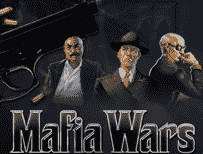

# Zynga 在主要零售商处推出预付费游戏卡 

> 原文：<https://web.archive.org/web/https://techcrunch.com/2010/03/25/zynga-rolls-out-pre-paid-game-cards-at-major-retailers/>

# Zynga 在主要零售商推出预付费游戏卡

大受欢迎的游戏 [Zynga](https://web.archive.org/web/20221007070523/http://www.zynga.com/) 现在[在美国多家主要零售商销售](https://web.archive.org/web/20221007070523/http://www.businesswire.com/portal/site/home/permalink/?ndmViewId=news_view&newsId=20100325005516&newsLang=en)预付费游戏卡，包括 7-Eleven、Best Buy、GameStop 和 Target。在 Zynga games、FarmVille、Mafia Wars 和 YoVille 上花钱的礼券将在 12，800 多家商店出售。

在 Playdom [去年秋天在包括沃尔格林和英国零售商在内的商店推出](https://web.archive.org/web/20221007070523/http://www.virtualgoodsnews.com/2009/10/zynga-playdom-go-headtohead-with-prepaid-cards.html)游戏卡后，有传言称 Zynga 正在开发其预付费游戏卡。游戏卡的设计是为了方便那些没有信用卡或银行账户的消费者购买游戏中的物品。10 美元或 25 美元的卡也可以作为礼物购买，并可以兑换成游戏中的货币，以获得拖拉机、能量包和家具等物品。在 FarmVille.com、MafiaWars.com 和 YoVille.com，游戏卡可以通过脸书的游戏兑换。

这应该有助于 Zynga 创造另一个收入渠道，并进一步扩大其在主流市场的存在，尽管这家游戏开发商已经非常受欢迎，尤其是在脸书。目前，Zynga 的游戏每天在全球有 6700 万用户玩，月活跃用户为 2.35 亿。该公司的收入正在飞速增长；2009 年，Zynga 是 PayPal 的第二大商家。去年 12 月，该公司刚刚融资 1.8 亿美元，传言估值为 20 亿美元。