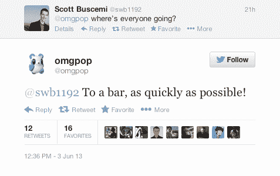

# Zynga 在以 2 亿美元收购 OMGPOP 一年后关闭了它 TechCrunch

> 原文：<https://web.archive.org/web/https://techcrunch.com/2013/06/04/zynga-shuts-down-omgpop-one-year-after-acquiring-it-for-200m/>

# Zynga 在以 2 亿美元收购 OMGPOP 一年后关闭了它

随着 Zynga 昨天大规模裁员的尘埃落定，损失的程度变得越来越明显。

还记得去年 Zynga 以大约 2 亿美元的价格收购 OMGPOP 吗？是的，OMGPOP 基本上已经不存在了。

根据该公司员工的推文和该公司的 Twitter 账户本身，OMGPOP 的大多数员工都被解雇了，他们在纽约市的办公室也关闭了。

【T2

**摘自 OMGPOP 前“人民副总裁”:**

**来自其前任高级社区经理:**

**来自公司本身:**

Zynga 在 OMGPOP 最成功的时候收购了它，正如 Draw Something——OMGPOP 的第一个真正轰动一时的作品——在各地的手机上爆炸一样。当 Zynga 在游戏中添加他们的标志时，它的受欢迎程度已经下降了。

唉，这两家公司似乎从未找到一种舒适的方式坐在一起。我们之前听说从第一天起就有一些非常严重的文化冲突——就在两个月前，OMGPOP 首席执行官丹·波特离开了公司，因为他在一次小组讨论会上发表的声明被“[断章取义](https://web.archive.org/web/20221225225737/http://qz.com/60731/zynga-copies-competitors-games-says-zynga-vp/)”暗示 Zynga 公开抄袭竞争对手的游戏。我没有意识到这仍然是争论的焦点。

目前还不清楚 Zynga 打算如何处理 OMGPOP 的在线游戏门户网站(该公司在转向移动业务之前的主要关注点)，以及他们是否会继续使用 OMGPOP 品牌。

昨晚，我和几位现已离职的 Zynga 员工一起喝酒，他们中的大多数人对整件事都异常乐观。“遣散费足以让我支撑一段时间，”一个人说，“但无论如何，我团队中的大多数人在离开大楼时都已经找到了新工作。”

