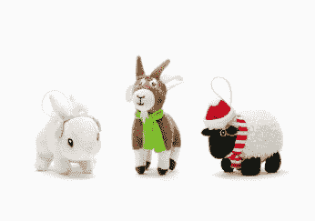

# Zynga 与百思买联手销售 FarmVille 收藏毛绒玩具 

> 原文：<https://web.archive.org/web/http://techcrunch.com/2011/11/14/zynga-teams-up-with-bestbuy-to-sell-farmville-collectible-plush-toys/>

# Zynga 与百思买联手销售 FarmVille 收藏毛绒玩具

Rovio 的热门游戏《愤怒的小鸟》已经把提供毛绒玩具变成了一门生意，社交游戏巨头 Zynga 进入这个市场也只是时间问题。今天，Zynga 宣布与电子零售商百思买(Best Buy)合作，在美国的百思买商店(及其零售网站)销售该公司热门游戏 FarmVille 的限量版玩具。你可以在这里订购玩具[。](https://web.archive.org/web/20230203090844/http://www.bestbuy.com/site/searchpage.jsp?_dyncharset=ISO-8859-1&id=pcat17071&type=page&ks=960&st=Farmville_54951_20111114&sc=Global&cp=1&sp=-displaydate+skuid&qp=q4661726d76696c6c655f35343935315f3230313131313134~~cpcmcat248700050021%23%231%23%232~~cpcmcat252700050006%23%231%23%232~~cpcmcat254300050001%23%231%23%232~~ncpcmcat240400050068%23%230%23%232&list=y&usc=All+Categories&nrp=15&p=%5Bpromotion%2C+synonymns%5D&_D%3Ap=+&pu=defaultusr&_D%3Apu=+&pt=1321250401&iht=n&ref=70&loc=700)

百思买将向顾客提供八种独家的 FarmVille 收藏品毛绒玩具，包括猪、山羊、牛、羊、鸡、鸭、马和兔子，所有这些玩具都穿着季节性的冬季服装。玩具的预购从今天开始，从 11 月 25 日开始在店内销售。

每个 FarmVille 毛绒玩具的售价为 9.99 美元，配有 10 个免费的农场现金代币和一个数字代码，可以在 FarmVille 收集一个限量版的游戏版毛绒玩具。这些玩具也将作为游戏卡套装的一部分出售；你可以购买一张 25 美元的 Zynga 游戏卡，并以 0.99 美元的价格获得一个毛绒玩具。收集到所有八种动物的玩家将在 FarmVille 获得一个游戏内超级果园。

Zynga 业务开发总监表示，玩家们要求 FarmVille 动物拥有真正的玩具已经有一段时间了。当然，这些都是季节性商品，所以看看 Zynga 是否真的在节后将这变成一个更广泛的业务应该会很有趣。Rovio 在 T4 每月销售 100 万件 t 恤和毛绒玩具，所以这对 Zynga 来说是一笔大生意。

如果你想要一个 FarmVille plus 玩具，你最好快点预定。Zynga 总共只生产了 25 万件玩具。

