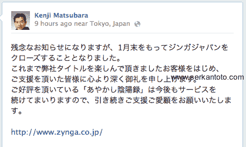
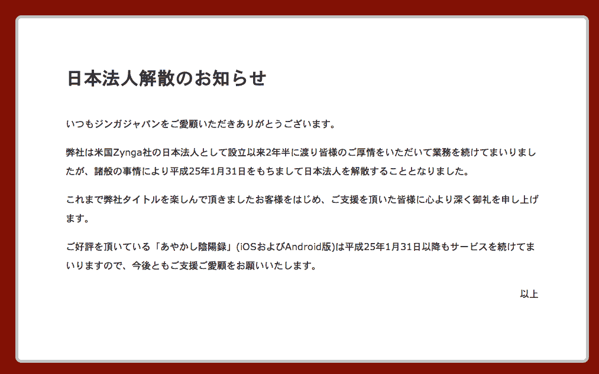

# Zynga 证实将在 1 月底关闭日本业务，因为整合仍在继续影响社交游戏公司 

> 原文：<https://web.archive.org/web/https://techcrunch.com/2012/12/21/zynga-to-close-its-japan-operation-at-the-end-of-january-as-company-continues-to-conserve-and-consolidate/>

# Zynga 证实将在 1 月底关闭日本业务，因为整合仍在继续影响这家社交游戏公司

社交游戏巨头 Zynga 现已确认将关闭其[日本业务](https://web.archive.org/web/20221208175740/http://www.zynga.co.jp/)，继续整合其业务并削减利润较低的业务部分。10 月份,当公司裁员 5%时，退出那个市场的恐惧首次在[出现。今天，日本业务的首席执行官 Kenji Matsubara 在脸书上发布了确认关闭的消息，(讽刺的是)，这个社交网络](https://web.archive.org/web/20221208175740/https://beta.techcrunch.com/2012/10/23/zynga-ceo-mark-pincus-confirms-layoffs-5-of-workforce-potential-closures-for-u-k-japan-offices/)[与 Zynga 的兴衰](https://web.archive.org/web/20221208175740/https://beta.techcrunch.com/2012/11/29/zynga-facebook-deal-amendment/)联系如此紧密。

没有给出关闭的直接原因，但它可能与日本游戏销售不佳有关。

这条新闻最先被 [Serkan Toto](https://web.archive.org/web/20221208175740/http://www.serkantoto.com/2012/12/21/zynga-japan-close-down/) 发现，他发布了一张首席执行官状态更新的截图:

他注意到日文内容如下:“Zynga Japan 将于 1 月底关闭，松原感谢用户玩他公司的游戏，热门卡牌游戏 Ayakashi 的服务将继续。”

[网站](https://web.archive.org/web/20221208175740/http://www.zynga.co.jp/)也传达了类似的信息，间接暗示虽然一些游戏已经被证明很受欢迎，并将继续得到支持，但其他游戏则不然:

在翻译中(非常，非常粗略，使用谷歌翻译)，它是这样写的:

> "**日本法人解散通知**感谢您光顾 always Zynga Japan。我们将继续工作，但我得到了每个人的好意，自从它作为美国公司 Zynga 的日本子公司成立两年半以来，由于各种原因于 2013 年 1 月 31 日解散了日本 Womochimashite 公司。
> 我衷心感谢每一个人，包括享有我们过去称号的客户，我们得到了你们的支持。
> 由于我们将在 2013 年 1 月 31 日之后继续提供服务，因此《音绫歌录》已获得好评(以及 iOS 的 Android 版本)，感谢您的持续惠顾和支持。”

Zynga 与日本有着深厚的渊源。在它上市之前，它最大的支持者之一是软银，软银在 2010 年向其注入了 1 . 5 亿美元。Zynga 自己也无组织地扩张到这个市场，同年收购了 Unoh，据报道价值数十亿日元。

但是不祥之兆已经出现了一段时间:面对来自 GREE、DNA 和其他公司的竞争，Zynga 不仅游戏收入和玩家数量下降，而且已经注意到它正在考虑在 10 月份关闭。上个月，它关闭了市场上的三个游戏，开始了这个游戏。

现在的一个问题是英国可能会发生什么——在 10 月份裁员中提到的另一个市场。该公司已经[关闭了其在该国的游戏工作室](https://web.archive.org/web/20221208175740/http://www.telegraph.co.uk/finance/newsbysector/mediatechnologyandtelecoms/9629739/Video-game-job-losses-as-Zynga-shuts-UK-studio.html)，英国总经理[已于上月](https://web.archive.org/web/20221208175740/http://www.gamesindustry.biz/articles/2012-11-27-zynga-mobile-uk-general-manager-departs)离职。但另一方面，英国在该公司重振利润的最新战略努力中发挥了重要作用:进军真钱赌博，这是该公司与 bwin 合作进行的。