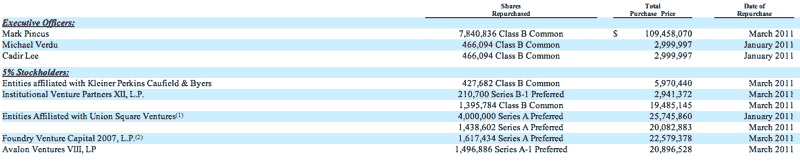
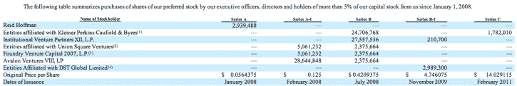

# Zynga 的最大股东及其持股数量 

> 原文：<https://web.archive.org/web/http://techcrunch.com/2011/07/01/zyngas-largest-shareholders-and-how-much-they-own/>

# Zynga 的最大股东及其持股数量

Zynga 刚刚提交了期待已久的 10 亿美元 IPO 申请，现在我们知道创始人马克·平卡斯和该公司的投资者在该公司拥有多少股份。Zynga 的投资者包括雷德·霍夫曼、DST、谷歌、老虎环球、凯文·罗斯、凯鹏华盈、联合广场投资公司、安德森·霍洛维茨、彼得·泰尔、铸造集团和 IVP。

平卡斯是 Zynga 的最大股东，拥有该公司 16%的股份(都是 b 股)。凯鹏华盈拥有该公司 11%的股份；IVP 拥有 6.1%的股份；联合广场风险投资公司拥有 5.5%的股份；Foundry 拥有 6.1%，Avalon Ventures 拥有 6.1%，DST 拥有 5.8%。

平卡斯年薪 30 万美元，范纳塔年薪 20 万美元。

Pincus 在 3 月份实际出售了 7，840，836 股股票，总价为 109，458，070 美元。今年早些时候，Union Square Ventures、Foundry、Kleiner Perkins、Avalon 和 IVP 都向 Zynga 回售了股份(见下图)。

