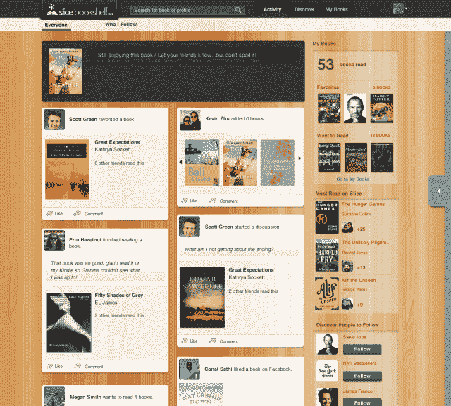
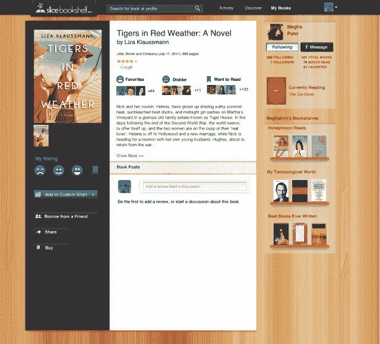

# 埃里克·施密特(Eric Schmidt)支持的 Slice 超越了收据跟踪，推出了面向读者的社交网络 Bookshelf 

> 原文：<https://web.archive.org/web/https://techcrunch.com/2013/06/06/eric-schmidt-backed-slice-moves-beyond-receipt-tracking-with-debut-of-bookshelf-a-social-network-for-readers/?_ga=2.2189552.152585094.1534706915-1510196584.1533849207>

既然最大的[Goodreads 已经被最大的在线零售商](https://web.archive.org/web/20221209142311/https://beta.techcrunch.com/2013/03/28/amazon-acquires-social-reading-site-goodreads/)(也是 Kindle 的制造商)亚马逊抢走了，那么书迷的另一个社交网络还有空间吗？[片](https://web.archive.org/web/20221209142311/https://www.slice.com/)这样认为。今天，移动收据跟踪服务[在](https://web.archive.org/web/20221209142311/https://beta.techcrunch.com/2011/05/26/online-shopping-startup-projectslice-raises-9-4-million-from-eric-schmidt-michael-birch-and-others/)埃里克·施密特的创新努力、Lightspeed、Floodgate 和其他公司的支持下，正在扩展到一个新的垂直领域，其第二个应用程序 [Slice Bookshelf](https://web.archive.org/web/20221209142311/http://www.slice.com/bookshelf) 首次亮相。

与该公司的旗舰应用程序一样，这项新服务也利用了 Slice 专有的电子邮件扫描技术，该技术以前曾用于让用户[洞察他们的购买行为](https://web.archive.org/web/20221209142311/https://beta.techcrunch.com/2012/07/12/eric-schmidt-backed-slice-reveals-revamped-ios-and-android-apps/)，并提醒他们即将到来的发货和交付。Slice 首席执行官斯科特·布兰迪表示，这种应用不会消失。这只是该公司想要深入挖掘的一个领域。

布雷迪拒绝透露 Slice 活跃用户的下载数量，但指出，在上市近 18 个月的时间里，该应用已对约 7500 万次购买进行了分类，相当于 25 亿美元的消费者支出。如今，该公司将其技术授权给网络和移动设备上的其他应用，并正在与更大的品牌进行讨论，以更好地了解客户的购买行为和趋势。

“如果你想想亚马逊这样的公司拥有的力量，就他们对客户的真正高分辨率而言，我们可以有效地在成千上万的商家之间实现相同的分辨率，”布雷迪解释了切片数据的使用方式。

新的 Slice Bookshelf 服务还可以帮助亚马逊的竞争对手利用与亚马逊自己的推荐引擎类似的技术来挑战这家书商巨头——当然，前提是 Slice Bookshelf 能够获得足够的牵引力，使其数据变得有价值。

在这方面，[切片书架](https://web.archive.org/web/20221209142311/http://www.slice.com/bookshelf)至少还有机会。与 Goodreads 不同，Goodreads 的图书索引和分类技术严重依赖手动输入，而 Slice Bookshelf 的过程是自动的。用户只需将他们的电子邮件收件箱连接到该服务，它就会根据你的购买历史来建立你的图书馆——电子书或其他。对于目前(或已失效)的 Goodreads 用户来说，也可以选择从现在亚马逊拥有的服务中导入你的书籍。

此外，你可以将 Slice Bookshelf 连接到脸书，在那里添加你在脸书喜欢的书籍，将你与和你有相同阅读兴趣的脸书朋友联系起来，甚至可以通过社交网络进行图书借阅请求。

但是布雷迪坚持认为，尽管这两种服务有相似之处，但这里的目标不是从 Goodreads 那里窃取市场份额。

“我不确定使用这个产品会让你不想使用 Goodreads，”他说。“如果你真的想研究一本书，或者谈论一位即将出书的作者，Goodreads 非常棒。我们试图做的是创造一种更轻松的体验，一种围绕你可能会更经常使用的书籍的更社会化的体验。但如果你真的想深入了解，你可以去很多网站。”

所以对大众来说好的读物，可能？

Slice Bookshelf 是在脸书平台上从头开始构建的，旨在使这项服务天生具有社交功能，而不是在事后才添加社交分享功能。这样做，它不仅使用你的脸书个人资料，如上所述，它还可以帮助你发现你的网络中谁是像你一样的读者。

布雷迪说:“我们不确定‘朋友’是否也代表了你可能喜欢的书籍的相关性，所以我们花了很多时间整合一些非常有趣的技术，这些技术可以揭示你的朋友中谁实际上有非常共同的兴趣。”该服务使用响应评级。通过问你*喜欢*、*喜欢*还是*讨厌*一本书，它会找到其他以同样方式评价这些书的人。但是这个系统也可以帮助用户找出你的网络中谁也可能想要讨论一本书——例如，一个喜欢《少年派的奇幻漂流》的人可以和一个声称讨厌这本书的人进行一场有趣的辩论。

随着 Slice Bookshelf 现在利用这家初创公司的核心技术，问题是 Slice 未来是否会涉足电影或音乐等其他垂直领域。尽管该公司并没有排除这种可能性，但它的下一步实际上是用更多类似“Google Now”的预测功能来增强其主要应用程序。Brady 已经是首批使用收件箱扫描技术概念来帮助挖掘隐藏数据趋势的人之一，他说现在是时候进一步发展这一概念了，该公司计划很快升级 Slice，增加新功能和核心功能。

与此同时，Slice Bookshelf 开始只提供网络服务(但通常是针对手机优化的)，并计划在未来推出原生应用。