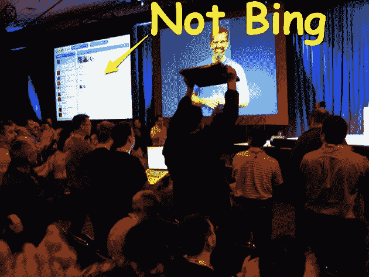

# 刚刚发生了什么？周四应该是宾日。TechCrunch

> 原文：<https://web.archive.org/web/https://techcrunch.com/2009/05/28/what-just-happened-thursday-was-supposed-to-be-bing-day/?awesm=tcrn.ch_2oM&utm_campaign=techcrunch&utm_content=techcrunch-autopost&utm_medium=tcrn.ch-twitter&utm_source=direct-tcrn.ch>

每个人都知道今天是微软发布新搜索引擎的日子。几个月来，每个人都在谈论这件事，媒体和营销努力都经过精心调整，以最大限度地扩大影响。2009 年 5 月 28 日星期四应该是微软必应日。

今天早上 8 点刚过，微软首席执行官史蒂夫·鲍尔默亲自登上加州圣地亚哥附近的独家 All Things Digital 会议的舞台，向数百名精英高管宣布，微软将很快[发布其新的搜索引擎](https://web.archive.org/web/20221006001459/http://www.beta.techcrunch.com/2009/05/28/bing-microsoft-prepares-for-war-with-a-revamped-search-engine-screenshots/)，并将其命名为 [Bing](https://web.archive.org/web/20221006001459/http://www.bing.com/) 。

一个直接的问题是:Bing.com 网站没有上线。由于直到鲍尔默说出这个名字，普雷斯才知道这个名字，所以这个消息过了一段时间才传播开来。

另一个问题是:一个位于悉尼的谷歌工程师团队同时宣布了一个名为 Wave 的历时 4 年多的隐形项目。而且它并没有向少数几个顶级企业高管公布。相反，创造它的团队在加州旧金山举行的谷歌 IO 大会上向 4000 名开发者展示了它。

你知道《魔戒》电影中的那一幕吗？山顶上索隆的巨眼将视线从聚集在魔多黑门的联盟军队转移到真实的场景，佛罗多带着魔戒站在末日裂缝处？

今天基本就是这样。当他们意识到发生了什么时，世界的目光和媒体的目光从圣地亚哥转向了旧金山。当时的情况是这样的:谷歌用一款科技界长久以来最雄心勃勃、最激动人心的产品抢走了微软的风头。

在 Google Wave 演示结束时，4000 名开发人员起立欢呼，这是我们在史蒂夫·乔布斯的主题演讲之外从未见过的。上面的照片不是一群头发花白的高管在为必应欢呼。这是一群工程师对谷歌新的开源通信平台的狂热。是的，右边的那个家伙兴奋地在空中挥舞着他的笔记本电脑。

事实上，出席的每个人都因为前一天免费发放的 Android G2 手机而容光焕发，这也没什么坏处。

发生了什么事？嗯，不做坏事的公司肯定会在需要的时候参与一些秘密的黑色行动。谷歌非常清楚 Bing 将于何时发布。他们精心策划了几分钟后的 Wave 发射。他们知道观众已经准备好了一些很酷的东西。他们不仅有免费的手机，而且在前一天，谷歌工程副总裁维克·冈多特拉告诉人群，第二天将有一个大的声明。人们已经准备好并愿意被惊叹。

虽然 Wave 当然值得今天得到的每一点积极的关注，但它是一个开源项目的事实也没有伤害到它。旧金山工程师喜欢开源，就像东海岸自由主义者喜欢奥巴马一样。

微软从来没有机会。就旧金山开发者群体而言，必应代表着“但它不是谷歌。”

图片来源:我不知道。如果你知道，请在评论中告诉我，这样我可以请求原谅未经允许使用它，并给予适当的信任。更新:[克里斯·坎贝尔](https://web.archive.org/web/20221006001459/http://twitter.com/quaelin/status/1957432037)给[拍了照片](https://web.archive.org/web/20221006001459/http://www.flickr.com/photos/quaelin/3574598412/)，根据下面的评论。谢谢克里斯！