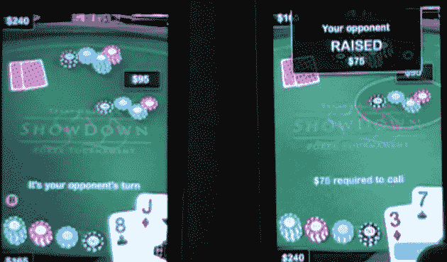

# 社交手游火热。300 万美元热门 

> 原文：<https://web.archive.org/web/https://techcrunch.com/2009/08/12/social-mobile-games-are-hot-3-million-hot/?awesm=tcrn.ch_5M3Z&utm_campaign=techcrunch&utm_medium=tcrn.ch-twitter&utm_source=direct-tcrn.ch&utm_content=twitter-publisher-main>

# 社交手游火热。300 万美元热门

总部位于西雅图的 [Z2Live](https://web.archive.org/web/20221006010029/http://www.z2live.com/) ，一个新的移动社交游戏平台，将于明天宣布第二轮融资——来自 [Madrona Venture Group](https://web.archive.org/web/20221006010029/http://www.crunchbase.com/financial-organization/madrona-venture-group) (也是总部位于西雅图)的300 万美元，超过他们去年从 Madrona 筹集的 100 万美元。来自 Madrona 的 Paul Goodrich 是该公司的董事会成员。

该公司将自己描述为*“第一个移动多人游戏平台”*，并为 iPhone/iPod Touch 产品创建了一个多人游戏平台。他们还提供一系列服务来实现订阅。他们说，该平台支持各种各样的社交游戏，包括:回合制休闲游戏、赛车游戏、角色扮演游戏，以及最终最复杂的第一人称射击游戏。这个平台是免费的，Z2Live 从游戏收入中提成。

这家公司的公司结构很复杂。Z2Live 是 Zero260 的一个部门，[今年推出了另一款产品](https://web.archive.org/web/20221006010029/http://www.techflash.com/Madronas_new_mystery_startup_Zero260__40546362.html)，名为 [PhotoFeedd](https://web.archive.org/web/20221006010029/http://www.feedd.com/) 。这些公司是由大卫·布鲁姆和达蒙·丹尼利创建的。

YouTube 视频展示了一个名为“摊牌:

[YouTube http://www.youtube.com/watch?v=GrjEIpVpdRY&hl=en&fs=1&]