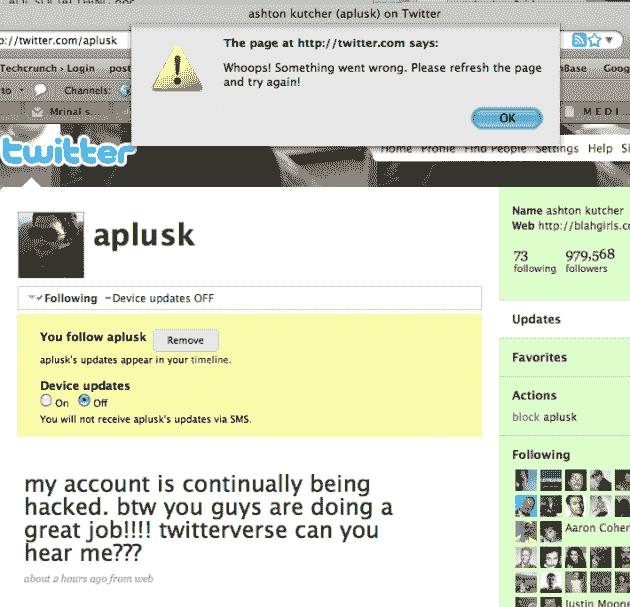
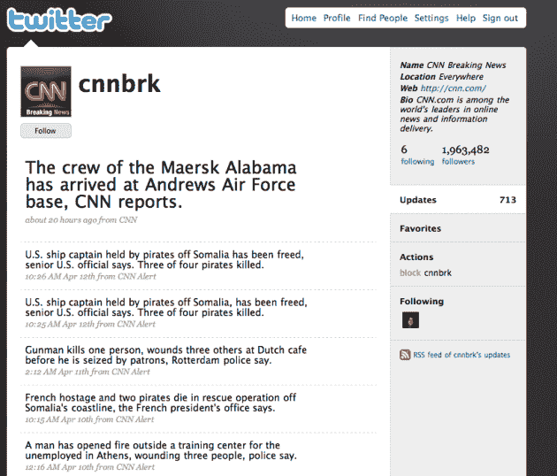

# 库彻在 Twitter 上超越了 CNN 但你也不能不关注 

> 原文：<https://web.archive.org/web/https://techcrunch.com/2009/04/16/kutcher-surges-past-cnn-on-twitter-but-you-cant-unfollow-either/?awesm=tcrn.ch_GN&utm_medium=awesm-twitter&utm_content=bookmarklet-twitter&utm_campaign=techcrunch&utm_source=direct-awesm>

# 库彻在推特上超越了 CNN 但是你也不能不关注

在这之前，尽管媒体铺天盖地，阿什顿·库彻在成为第一个拥有百万粉丝的推特用户的竞争中还是落后于 CNN。不再是了。

[库彻](https://web.archive.org/web/20221006203434/http://twitter.com/aplusk)周四晚上冲过 [CNN](https://web.archive.org/web/20221006203434/http://twitter.com/cnnbrk) ，很可能扫清了他和泰德·特纳[家门口](https://web.archive.org/web/20221006203434/http://www.beta.techcrunch.com/2009/04/13/ashton-kutcher-promises-to-punk-ted-turner-if-he-beats-cnn-to-a-million-twitter-followers/)之间的最后一个障碍——他承诺如果这位 CNN 创始人是一百万追随者中的第一个，他就会抛弃他。从那以后，库彻和其他人加大了赌注。EA 正在向库彻的第 100 万名粉丝提供一份它在 2009 年制作的每一款游戏的拷贝，并在《模拟人生 3》游戏中扮演一个角色。现在库彻提议，如果他获胜，将购买 10，000 顶蚊帐，帮助阻止疟疾在非洲的传播。CNN 也承诺购买蚊帐，无论输赢。

但是舞台已经为库彻准备好了。目前拥有超过 980，000 名粉丝，他明天将出现在奥普拉脱口秀上，与该服务的首席执行官伊万·威廉姆斯一起谈论 Twitter。奥普拉今天刚刚注册了她的推特账户，她承诺将在明天的节目中发送她的第一条推特。

库彻在 Twitter 追随者中的领先地位令人惊叹。仅今天一天，他就增加了数万名粉丝。这帮助他克服了对 CNN 有利的不利因素。网站[Bookmaker.com](https://web.archive.org/web/20221006203434/http://bookmaker.com/)称已经收到了数千份关于这场比赛的赌注，并认为 CNN 的账户以-500 的赔率获得第一，库彻的赔率持平。

但是整件事情的一个奇怪之处是，显然你现在不能在 Twitter 上不关注库彻或者 CNN！去吧，试试看，你会得到一个很好的错误信息，说有什么地方出错了。Twitter 是想确保库彻在明天的奥普拉脱口秀上赚到一百万吗？锡纸帽时间！

**更新**:实际上，正如[mobile runch 的](https://web.archive.org/web/20221006203434/http://mobilecrunch.com/) Greg Kumparak 刚刚和我分享的，你可能也不能取消关注，这样你就不能玩 Kutcher 和 EA 的第一百万个关注者赠品游戏了。所以我希望你喜欢你的阿什顿和 CNN 更新！

另一个奇怪的地方是，有些人看到某些用户的追随者数量大幅上升。CNN 账号就是其中之一，见下面截图。(虽然我还是看到了正确的金额。)Twitter 似乎在突破 100 万大关的过程中遇到了一些问题。

这是库彻在 Ustream 上录制的关于里程碑的视频。值得注意的是，库彻说他将开始关注更多的人。

[http://www.ustream.tv/flash/video/1393560](https://web.archive.org/web/20221006203434/http://www.ustream.tv/flash/video/1393560)免费电视:Ustream