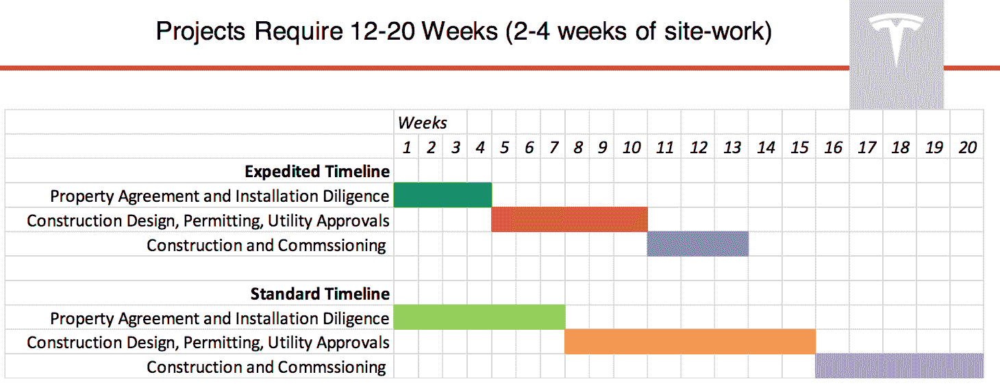

# 特斯拉超级充电站合作伙伴计划内幕:道路交通电气化的成本和承诺 TechCrunch

> 原文：<https://web.archive.org/web/https://techcrunch.com/2013/07/26/inside-teslas-supercharger-partner-program-the-costs-and-commitments-of-electrifying-road-transport/?goback=.gde_4535494_member_261265017>

特斯拉正在美国建立一个全国性的超级充电站网络，以帮助其不断增长的消费车辆车队获得征服美国高速公路所需的动力，现在我们在 TechCrunch 上深入了解他们是如何接触合作伙伴以帮助他们扩张的。特斯拉为超级充电站买单，只要求合作伙伴提供时间和停车场，并承诺未来的钥匙作为回报。

根据 TechCrunch 获得的文件，对于特斯拉超级充电站的“潜在主人”,要求并不太高:特斯拉支付了所有与安装超级充电站相关的前期和持续成本。这包括维护和电力成本，特斯拉可以选择仅为充电站安装专用电表，账单将直接计入特斯拉自己的账户。

根据加油站的不同，特斯拉的成本在 10 万美元到 17.5 万美元之间，其中很多来自该站点支持增压器本身所需的永久性修改。这比给标准电动汽车(例如日产 Leaf)安装充电器更昂贵，但在相同的时间内，超级充电站可以提供大约五倍于这些加油站的电力，因此在基础设施变化方面要求更高。

业主不需要在金钱上做出任何承诺，但它必须提供平均四到五个空间，加上大约 200 到 600 平方英尺的增压器和设备。大多数协议涉及四个“专用”加油站，设计为只有特斯拉车主可以使用它们(防止司机到达后找不到停车位)，以及四到六个额外的加油站，可以容纳普通汽车，并为特斯拉提供增压。这也不需要是最好的房地产，尽管特斯拉确实规定它要光线充足，如果可能的话，要靠近现有的电力基础设施。

合作伙伴需要对该计划承诺至少五年的时间，并且可以选择扩展，大多数协议的期限为五至十年。所需承诺的时间反映了初始安装的巨大成本。作为交换，特斯拉出售的本质上是与其品牌相关的形象利益；合作伙伴获得了作为特斯拉所在地的神秘感和影响力，吸引其司机到他们的现场业务，是的，但也提供了媒体和社交媒体的个人资料。此外，对于有环境可持续发展计划和优先事项的公司来说，品牌联盟的好处显然也很有吸引力。

 特斯拉 docs 还显示了其站点的高使用率，在高峰使用时段，一些设备每天会出现多达 17 个会话，这一事实可以用来说服合作伙伴，所提供的空间将为他们的商店和企业带来更多流量。增压器的安装需要 12 至 20 周才能完成，但其中只有 2 至 4 周是在现场进行的，其余的包括文书工作、业务安排以及获得当地许可和批准。

如果特斯拉支付全部费用，在你的路边商店安装增压器似乎是一件显而易见的事情，但就建设时间和承诺的空间而言，这涉及到一笔巨大的成本，因此可以理解电动汽车公司必须通过这些推介文件来证明自己的观点。对我们来说，它们提供了一个有趣的视角，让我们了解参与其中的各方需要做些什么，来为未来的电动交通铺平道路。