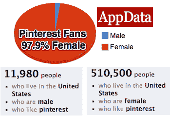
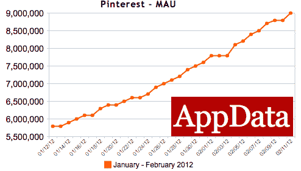
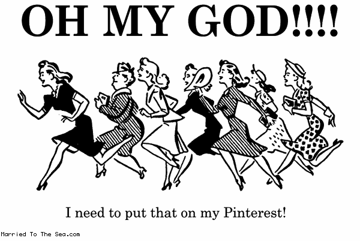

# 女士们在哪里？Pinterest。每天 200 万脸书用户，97%的粉丝是女性 

> 原文：<https://web.archive.org/web/https://techcrunch.com/2012/02/11/pinterest-stats/?grcc=33333Z98>

# 女士们在哪里？Pinterest。每天 200 万脸书用户，97%的粉丝是女性

OMG。根据 [Inside Network 的 AppData](https://web.archive.org/web/20221004062205/http://www.appdata.com/apps/facebook/274266067164-pinterest) 追踪服务，Pinterest 现在拥有超过 1040 万注册用户，900 万每月脸书连接用户，200 万每日脸书用户。凭借华丽的照片和购物网站链接，Pinterest 正成为一群女性的痴迷对象。他们不怕表现出来，我是说，喜欢。AppData 和脸书的广告工具显示，超过 97%的 Pinterest 脸书粉丝是女性。

惊人的女性粉丝群可能是 Pinterest 实际用户群的有力代表，考虑到有多少用户关注官方“Pinterest”账户，Pinterest 的实际用户总数超过 1040 万。

尽管这个网站是由三个男人共同创建的，但它并不羞于追求女性。这是关于第页的[描述说“人们使用图钉板来计划他们的婚礼，装饰他们的家，组织他们最喜欢的食谱。”](https://web.archive.org/web/20221004062205/http://pinterest.com/about/)

当然，男人也可以做所有这些事情，但他们可能不会沉迷于钉礼服和像女人钉新娘礼服和蛋糕这样的电动工具。Pinterest 易于使用的 Pin It bookmarklet 和策展的乐趣让女士们和先生们都参与进来。更新:Pinterest 还采用积极的重新参与电子邮件来通知用户他们的朋友何时加入，这可能有助于增长，但也会惹恼用户。]

超过 1/5 快速增长的脸书每月用户每天使用 Pinterest 。根据 AppData 的数据，2012 年初的日用户数仅为 81 万，但现在已经达到了 200 万。本周，comScore 称 Pinterest 在美国的月独立访客数达到 1000 万，比历史上任何独立网站都要快。

有这么多美好的东西可以分享，它们不应该在我们的推特信息和脸书个人资料的底部默默无闻。Pinterest 让人们有机会说“我喜欢这个，不仅仅是今天。这有助于定义我。”

[图片鸣谢:[嫁给了大海](https://web.archive.org/web/20221004062205/http://www.marriedtothesea.com/archives/2012/Feb/)