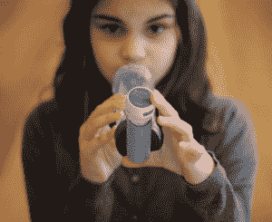

# Asthmapolis 希望破解吸入器，帮助 2600 万美国人更好地跟踪和管理他们的哮喘 TechCrunch

> 原文：<https://web.archive.org/web/https://techcrunch.com/2013/04/05/asthmapolis-wants-to-hack-the-inhaler-and-help-26-million-americans-better-track-and-manage-their-asthma/?guccounter=1>

除非你正在使用吸入器阅读这篇文章，否则这个事实可能会让你大吃一惊:[根据 CDC](https://web.archive.org/web/20221204185039/http://www.cdc.gov/nchs/fastats/asthma.htm) 的数据，目前有 2600 万美国人患有慢性呼吸道疾病，我们称之为哮喘。不仅如此，疾病预防控制中心告诉我们，这种疾病每年在美国人均花费 3300 美元，与哮喘相关的医疗费用已增加到约 560 亿美元(由于住院治疗、急诊室就诊和缺勤)，而超过 10%的美国参保人负担不起他们的处方药。

[Asthmapolis](https://web.archive.org/web/20221204185039/http://asthmapolis.com/) 于 2010 年推出，旨在通过利用传感器技术的进步(以及生产所述传感器的成本降低)和移动数据监测来帮助人们更有效地管理他们的哮喘，从而降低哮喘患者和美国医疗保健系统本身的成本，从而帮助找到解决方案。今天，这家总部位于威斯康星州的初创公司宣布，它已经从 Social+Capital Partnership 获得了 500 万美元的首轮融资，为慢性呼吸系统疾病患者建立了一个全面的解决方案和支持系统。

Asthmapolis 是新一代数字健康创业公司之一，试图破解在当今医疗保健领域继续流行的旧软件、设备和护理系统。例如，我们[最近写了一篇关于 Intersect ENT](https://web.archive.org/web/20221204185039/https://beta.techcrunch.com/2013/02/25/intersect-ent-lands-30m-from-norwest-kleiner-usvp-more-for-its-innovative-sinus-drug-device-combo/) 的文章，它是黑客支架(是的，支架)来帮助医生更有效地治疗 3100 多万鼻窦炎患者。

与此同时， [Glooko](https://web.archive.org/web/20221204185039/https://beta.techcrunch.com/2013/01/17/glooko-hires-intuit-health-exec-as-its-first-ceo-receives-fda-clearance-for-its-mobile-diabetes-tracker/) 、 [Omada Health](https://web.archive.org/web/20221204185039/https://beta.techcrunch.com/2013/03/21/omada-health-secures-4-7m-from-usvp-nea-kapor-more-to-roll-out-its-online-diabetes-prevention-program/) 和其他一些初创公司正在将移动和数字技术带给糖尿病患者，帮助他们管理病情，而[在 Omada 的情况下](https://web.archive.org/web/20221204185039/https://beta.techcrunch.com/2013/03/21/omada-health-secures-4-7m-from-usvp-nea-kapor-more-to-roll-out-its-online-diabetes-prevention-program/)，甚至有望预防糖尿病。

另一方面，Asthmapolis 正在执行入侵你的吸入器的任务。这家初创公司设计了 snap-on，支持蓝牙的传感器，可以跟踪人们使用吸入器的频率(以及位置和时间)，以及 iOS 和 Android 的分析和移动应用程序，帮助他们可视化和理解他们的触发因素和趋势，同时接收个性化的反馈。

 反过来，该解决方案所收集的数据使医生能够识别出有风险或需要更多帮助来控制其症状的患者。这使得他们有可能在攻击发生之前就阻止攻击，从而节省他们住院或去急诊室的费用。

事实上，Asthmapolis 的早期研究发现，这种对实时数据的访问能够将未受控制的哮喘患者(或不经常使用吸入器的人)的数量减少 50%。没有实时数据和收集人们出现症状的背景和情况的能力，医生在黑暗中摸索，等待攻击，然后分析背景并开始治疗。

许多初创公司开始认识到，通过将自己定位于移动设备和移动健康计划、个性化医疗、大数据和传感器等发展趋势的交汇点，可以创造可持续发展的业务和影响真正的变化。Asthmapolis 的联合创始人兼首席执行官大卫·范·西克尔认为，这家初创公司可以坐在这个十字路口，同时通过提供硬件和软件解决方案来区别于竞争对手。

不仅如此，Asthmapolis 还在 7 月份获得了 FDA 的批准，向消费者销售其哮喘跟踪设备和软件解决方案，这使其进入了一个非常短的名单。反过来，它的软件平台有英语和西班牙语两种版本，允许用户对他们的药物使用进行数字记录，同时接收个性化的反馈——两者都旨在提高他们成功管理疾病的能力。

从大的方面来看，这家初创公司还希望帮助公共卫生机构更好地评估他们的干预和治疗效果，并深入了解哮喘的工作原理和起源。这就是 Asthmapolis 赚钱的地方:通过向支付者和健康计划提供者出售其硬件和软件解决方案。通过更有效的治疗解决方案，保险提供商和医疗计划每年可以节省 4000 到 6000 美元的医疗费用，当然，这是银行存款。

该公司去年在这方面建立了许多合作伙伴关系，其中包括与 Amerigroup Florida/WellPoint 等支付方以及纽约州威科夫高地医疗中心和加利福尼亚州尊严健康等提供方的项目。展望未来，这家初创公司将寻求继续扩大与提供商和付款人的关系，以及在零售药店和公共部门的举措。

“Asthmapolis 在医疗保健 IT 领域处于独特的地位，”Social+Capital 普通合伙人 Ted Maidenberg 解释道，“其技术可以轻松地与现有行为(如使用吸入器)集成，同时添加大量数据(时间、位置、活动)，提供比非处方吸入器更智能的包装。”