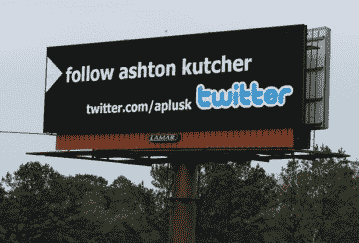
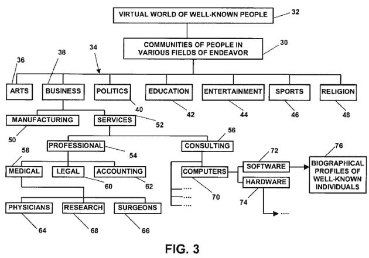

# Twitter 因允许名人在线互动而被起诉 TechCrunch

> 原文：<https://web.archive.org/web/http://techcrunch.com/2011/01/20/twitter-lawsuit-vs-technologies/?icid=main%7Cverizon%7Cdl8%7Csec3_lnk3%7C196585>

# 推特因让名人在线互动而被起诉

推特的部分吸引力在于，人们可以在网上与名人进行‘联系’和互动[，即使他们中的大多数人认为这只是另一个推送营销渠道，而不是一个多维交流系统。](https://web.archive.org/web/20230202235736/http://www.celebritytweet.com/)

尽管如此，Twitter 的受欢迎程度在很大程度上要归功于阿什顿·库彻、史蒂芬·弗莱、吹牛老爹、艾伦·德杰尼勒斯、50 美分以及其他许多使用和推广这项服务的名人。

现在，一家名为 VS Technologies 的公司[正在起诉 Twitter](https://web.archive.org/web/20230202235736/http://news.priorsmart.com/vs-technologies-v-twitter-l3Be/) ，声称其侵犯了[他们的一项专利](https://web.archive.org/web/20230202235736/http://www.google.com/patents/about?id=e-ULAAAAEBAJ&dq=6,408,309)，名为“创建名人互动虚拟社区的方法和系统”。真的吗？真的。

在本周早些时候提交的诉状中(见下文)，VS Technologies 声称 Twitter 故意侵犯了上述专利[美国专利号 6，408，309](https://web.archive.org/web/20230202235736/http://www.google.com/patents/about?id=e-ULAAAAEBAJ&dq=6,408,309) 。

直接来自文件:

> 因为它与该诉讼有关，非常一般地说,‘309 专利公开了用于在各种努力领域中创建交互式虚拟社区的方法和系统，其中每个社区成员具有包含关于该成员的信息的交互式个人简档。

不知什么原因，该公司早在 2002 年就获得了这项专利。由于我找不到任何关于该公司的信息或网站，看起来他们的“发明”毫无成效，因此我宣布它是 YAPT(又一个专利巨魔)。

VS Technologies 要求支付损害赔偿金，我引用一下，这应该足以补偿公司“被告的侵权行为，根据法律，这不能少于使用专利技术的合理使用费，以及本法院确定的利息和费用”。

是啊，祝你好运。

**更新:**Twitter 的一位女发言人代表公司向我们发布了这份声明:*我们不能对此事的细节发表评论。我们将积极为自己辩护，我们关注专利制度是否恰当地鼓励了创新。*

(顶部图片来自[公元](https://web.archive.org/web/20230202235736/http://adage.com/adages/post?article_id=136060))

