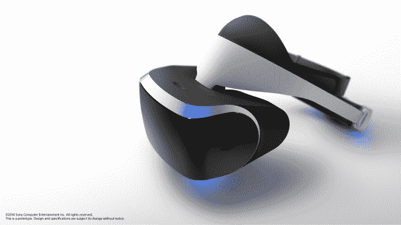

# 索尼宣布推出 PS4 TechCrunch 虚拟现实耳机 Project Morpheus

> 原文：<https://web.archive.org/web/https://techcrunch.com/2014/03/18/sony-announces-project-morpheus-a-virtual-reality-headset-for-the-ps4/?ncid=rss&utm_medium=referral&utm_source=pulsenews>

就这样，虚拟现实战争开始了。

索尼刚刚宣布他们正在为 PS4 开发一款虚拟现实耳机，这让 Oculus(这家公司在 90 年代经历了无数次失败后，让许多人再次对虚拟现实感到兴奋)开了一枪。

目前，索尼称之为“墨菲斯计划”——大概是向《黑客帝国》中的角色致敬。

以免你认为，既然 Oculus 已经引起了一点流行，索尼只是在追赶 VR 潮流:据索尼全球工作室总裁 Shuhei Yoshida 称，他们自 2009 年开始致力于 Playstation Move 以来，一直在修补 VR 原型。不过，那时候，他们实际上是用胶带把控制器贴在头上。2010 年，他们专门为 VR 创建了一个内部小组。

吉田很快指出，上图所示的原型硬件并不是最终版本。

**也就是说，他们确实分享了一些在他们目前的原型中发现的规格:**

*   1080p 显示屏
*   1000Hz 运动检测
*   一次仅支持一个耳机
*   耳机目前通过一根 5 米长的电线连接到 PS4
*   位置/旋转头部跟踪
*   跟踪由跟踪 PS4 移动控制器的同一个摄像机处理
*   它对戴眼镜的人有效
*   推送到 Morpheus 的内容可以镜像到电视上，但听起来它也可以处理不对称的游戏(每个屏幕上有不同的东西)。
*   “露天”设计防止镜片起雾。(看看它们如何防止光线漏进来会很有趣)

在索尼看来，他们需要在六个关键领域实现 VR 的完美:视觉、声音、跟踪、控制、易用性和内容。(抱歉，smellovision-hope 们！)

现在索尼入了法庭，Oculus 是不是就要完蛋了？几乎没有。到目前为止，Oculus 最大的成就并不是制造一副运动感应护目镜——大多数能够制造智能手机的公司都可以做到这一点，如果他们愿意的话。

他们最大的成就是让人们再次对虚拟现实感到兴奋。让成千上万的开发者参与进来。为了激起像约翰·卡马克这样的人和像 Valve 这样的公司的兴趣(Valve 已经承诺与 Oculus 分享虚拟现实研究。)建立一个活跃的、令人兴奋的开发者生态系统是一件非常、*非常*困难的事情。

无论如何，这个领域的竞争是一件非常非常好的事情。正如 Oculus 的产品 Nate Mitchell 在索尼发布声明前接受 IGN 采访时所说的那样[:](https://web.archive.org/web/20221207112825/http://www.ign.com/videos/2014/03/18/oculus-on-sonys-rumored-vr-headset)

> 因此，就竞争而言，我们必须看看他们会宣布什么。我们都希望有更多的人参与到虚拟现实空间中来。开发者对虚拟现实越兴奋，受众越大，他们就越有可能构建 VR 内容。因此，有一个主要的玩家在很大程度上支持虚拟现实，为更多的开发人员创建虚拟现实内容打开了大门。所以，我们真的希望他们做得对——任何做虚拟现实的人，最重要的事情就是把它做好。

朋友们，请关注这个空间——好戏才刚刚开始。