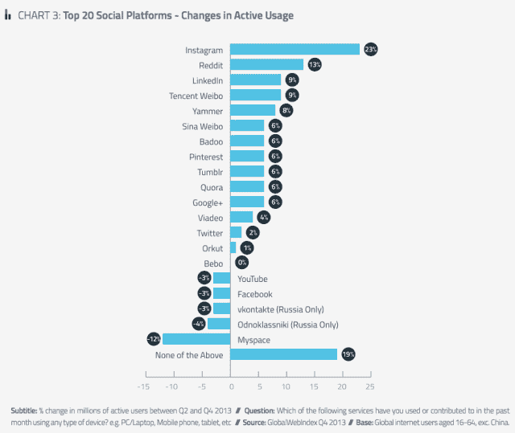
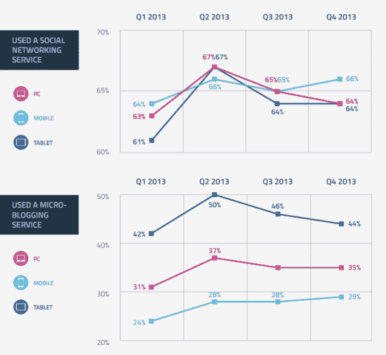
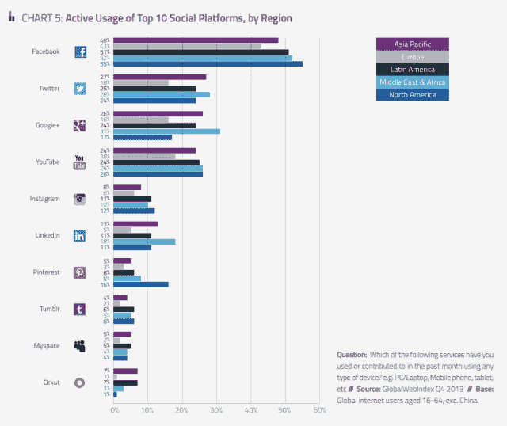
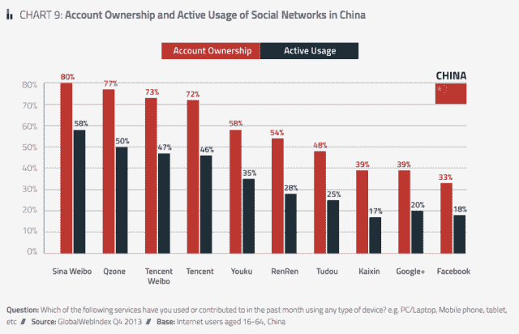

# Instagram 是全球增长最快的社交网站，移动设备在访问方面超过了个人电脑 TechCrunch

> 原文：<https://web.archive.org/web/https://techcrunch.com/2014/01/21/instagram-is-the-fastest-growing-social-site-globally-mobile-devices-rule-over-pcs-for-social-access/?ncid=twittersocialshare&utm_content=buffer2add6&utm_medium=social&utm_source=twitter.com&utm_campaign=buffer>

根据 Pew 上个月发布的新数据，Pinterest 在美国的受欢迎程度可能已经超过 Twitter，但在全球范围内，值得关注的社交网络可能是脸书旗下的 Instagram。根据 [GlobalWebIndex](https://web.archive.org/web/20221007215710/https://www.globalwebindex.net/) 今天发布的研究，Instagram 是全球所有社交媒体网站中增长最快的，在过去六个月中其活跃用户数量增加了 23%。但总体而言，它仍落后于脸书、YouTube、Google+、Twitter 和 LinkedIn 等公司，这些公司在全球最受欢迎的社交平台的渗透率方面分别排名第 1 至第 5 位。

而谁的活跃使用量在下降？脸书、YouTube、两个俄罗斯社交网络 Odnoklassniki 和 Vkontakte……还有 MySpace。

该调查基于来自 32 个国家的约 17 万用户的反馈，指出脸书是目前世界上最受欢迎的社交网络。除了中国(免费访问脸书和谷歌等网站存在问题)，其余超过 80%的受访者表示他们已经注册了脸书账户；大约 50%的人说他们是活跃用户——也是所有社交平台中比例最高的。

正如你在上表中看到的，在少数几个全球网站排名第一之后，这项研究还强调了大量社交媒体的使用存在于长尾上，个别网站在特定国家或地区得分较高。(在一个案例中，这特别有助于一家公司的形象:谷歌突然像一个真正的社交媒体玩家一样出现，YouTube、Google+和 Orkut 都进入了前 10 名。)

考虑到许多网站是广告资助的，因此是规模化的，这就引出了一个问题:我们是否会看到一些小网站之间的整合。无论如何，本地化的受欢迎程度表明，如果脸书(举例来说)决定开始吸收一些较小的公司，未来的道路可能是让它们作为独立实体运营，而脸书仍然受益于整体交通。

尽管不断有联网服务和好友涌入，但仍有相当数量的人拒绝加入。大约 10%的受访者没有使用这些服务。

我在下面嵌入了完整报告的摘录(我被要求删除完整报告)。这里还有一些值得一提的数据:

**移动为王**。说到社交网络服务，手机现在是最受欢迎的访问形式，66%的用户表示他们使用移动设备访问这些服务。这挤掉了个人电脑和平板电脑，后者的得分水平为 64%。GWI 的数据表明，上一次手机超过其他设备是在 2013 年的 Q1，事实上不同的平台正在玩一种[的壳游戏](https://web.archive.org/web/20221007215710/http://en.wikipedia.org/wiki/Shell_game)争夺领导权。

对于微博服务(包括消息应用和 Twitter 应用)来说，情况并非如此。在这一领域，平板电脑以 44%的渗透率遥遥领先。再加上手机占 29%的市场份额，个人电脑就真的出局了。

**地区细分**。技术世界通常认为北美，尤其是美国，是消费技术世界的中心，但在这里的细分中，您可以看到亚太地区的渗透率紧随其后。这些数字，和整体排名一样，不包括中国，我怀疑如果他们包括中国，他们的比例会以某种方式倾斜。

具体来看中国，最受欢迎的网站是新浪微博，注册账户的渗透率为 80%，活跃用户的渗透率为 58%。GWI 指出，尽管中国的防火墙问题限制了对某些网站的访问，但中国也是使用 VPN 隧道最普遍的国家之一，这使用户的设备看起来像是位于另一个国家，并让他们访问该国消费者通常无法访问的网站。VPN 普及率超过 50%。

[slide share id = 30247668 & doc = gwisocialsummary 2014-140121043204-PHP app 02 & type = d]