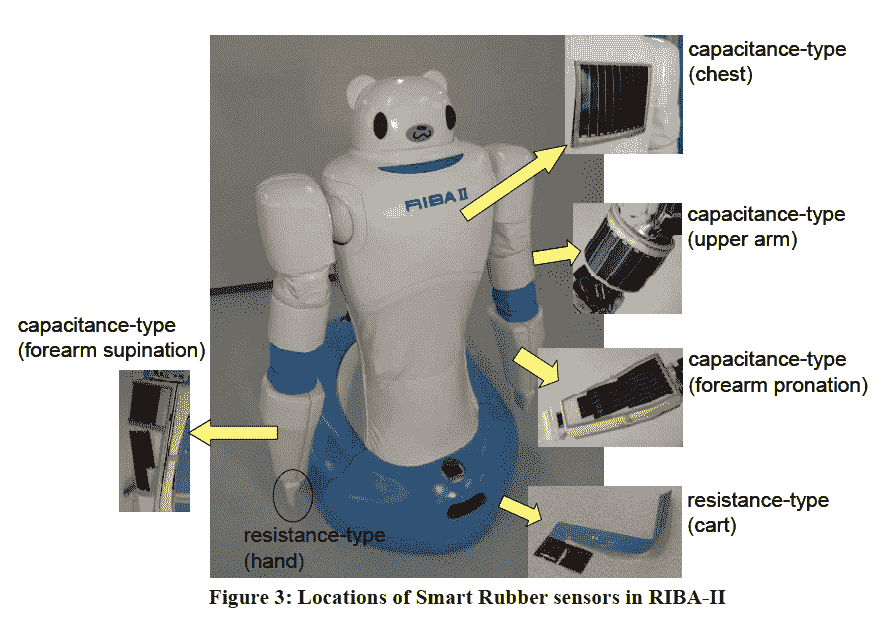

# 视频:观看可爱的医疗保健机器人 RIBA II 在运行 

> 原文：<https://web.archive.org/web/http://techcrunch.com/2011/10/26/video-watch-cute-healthcare-robot-riba-ii-in-action/?utm_medium=twitter&utm_source=twitterfeed>

# 视频:观看可爱的医疗保健机器人 RIBA II 的运行

RIBA II 是一个可爱的日本看护机器人 T1 的名字，我们在 T3 之前报道过 T2，但是现在有了一个专业制作的视频。这种双臂机器人是由[东海橡胶工业](https://web.archive.org/web/20230204145857/http://www.tokai.co.jp/english/)和[理研](https://web.archive.org/web/20230204145857/http://www.riken.go.jp/engn/)(一家位于东京的私人研究所)开发的，旨在让护理机构人员的生活更加轻松。

RIBA II 能够“轻轻地”将人(重达 80 公斤)从地板上抬到床上，将人类看护者从这项艰巨的任务中解放出来。他的制造商表示，他们设计了患者接触的材料，特别是手臂和手，尽可能柔软——这要归功于世界上第一个由橡胶制成的电容触摸传感器(见下文)。

  
一款商业版计划于 2015 年上市。

这段视频(由 [Diginfo TV](https://web.archive.org/web/20230204145857/http://www.diginfo.tv/2011/10/25/11-0215-r-en.php) 提供，英文)展示了 RIBA II 的行动:
【YouTube = http://www . YouTube . com/watch？v = wozw 71j 4b 78&w = 560&h = 315】