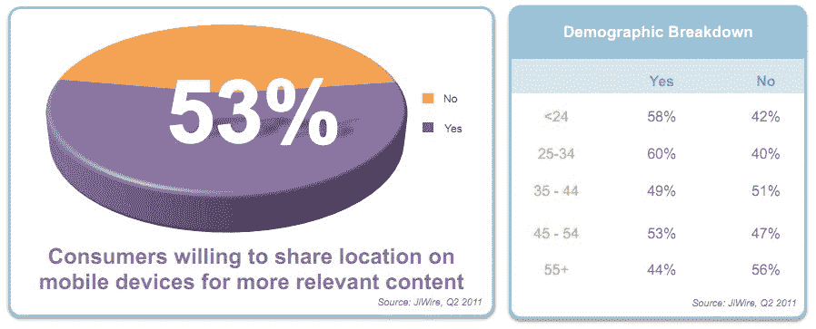
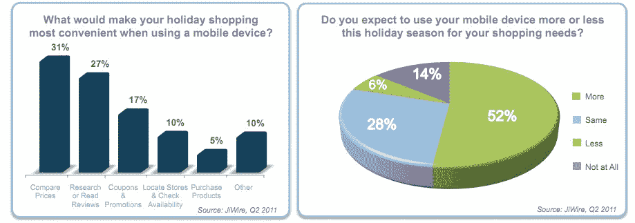
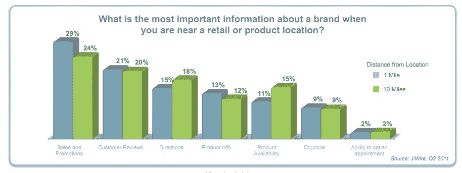
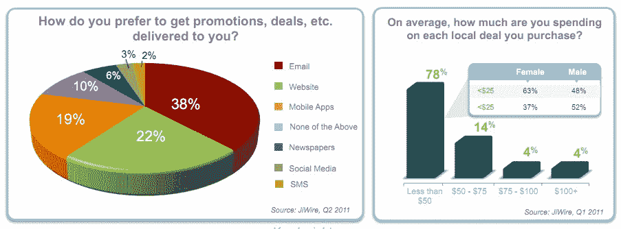

# 移动用户渴望提供他们的位置以换取更好的内容和交易 

> 原文：<https://web.archive.org/web/http://techcrunch.com/2011/08/17/mobile-users-eager-to-offer-their-location-in-exchange-for-better-content-deals/?utm_source=Street+Fight+List&utm_campaign=c8d6adc270-Street_Fight_Daily8_18_2011&utm_medium=email>

根据基于位置的媒体公司 JiWire 的一份新报告，53%的“移动”美国观众愿意交换他们的位置，以换取更相关的内容和更好的信息，包括移动交易。

在 34 岁以下的移动消费者群体中，这一比例甚至更高:60%的人愿意用自己的位置来换取信息。在英国，这一比例更高，69%的人愿意分享他们的位置。

【T2

JiWire 一直在追踪其所谓的“移动”受众群体中的这种趋势，这部分人群包括那些在家庭或工作场所之外使用笔记本电脑、平板电脑和智能手机的人。因此，需要明确的是，这些并不是适用于所有消费者的普遍趋势——它们只适用于高度移动的用户。然而，在移动交易市场，目标受众的习惯值得追踪。

**以地点换取交易**

JiWire 发现，用一个人的位置交换数据，包括基于位置的销售提醒和优惠券的愿望比以往任何时候都强烈。

例如，在这个假期，52%的人表示，他们希望比去年更多地使用移动设备。80%的人表示，他们计划与去年一样或多或少地使用他们的设备，高于 2010 年的 59%。

当消费者被问及他们认为关于一个品牌最重要的信息是什么时，当在零售店或产品所在地附近时，他们的回答是“销售和促销”这比顾客评论，方向，产品信息和可用性，甚至优惠券排名更高。

然而，当涉及到基于接近度的营销时，人们有一些不同的看法。29%的人表示，他们希望在商店 1 英里范围内获得销售和促销，而 24%的人希望在商店 10 英里范围内获得促销。

**电子邮件仍然是交易的最佳选择**

然而，在交易分布方面，38%的人仍然喜欢电子邮件，而 22%的人喜欢网络，只有 19%的人说他们希望通过“移动应用程序”获得交易只有 2%的人喜欢通过短信接收交易。

虽然目前电子邮件仍然是交易分发的首选，但它正在下降，从 2011 年 Q1 的 52%下降到上一季度的 38%。

【T2

在同一时期，交易分成有所增加，从 Q1 的 62%上升到 Q2 的 75%。交易通过电子邮件、口头传播和使用社交媒体工具分享。

92%的消费者每月至少购买一次本地交易，78%的消费者每次购买花费不超过 50 美元。

这份报告的更多数据现在可以在 JiWire 的网站上找到。