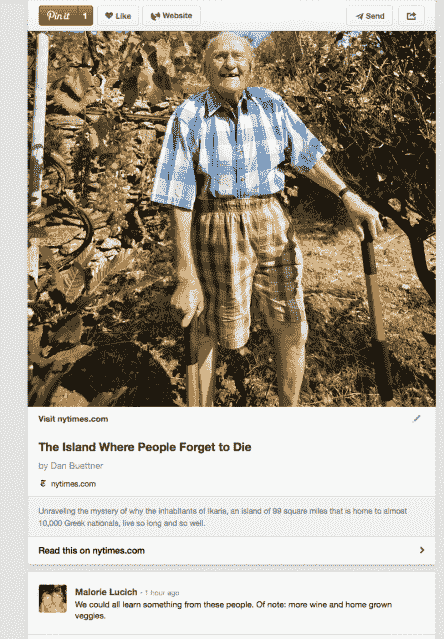

# Pinterest 用新文章图钉吸引出版商，推动成为书签和“以后再看”服务 

> 原文：<https://web.archive.org/web/https://techcrunch.com/2013/09/24/pinterest-article-pins/?utm_source=buffer&utm_campaign=Buffer&utm_content=buffer22644&utm_medium=twitter>

在[宣布推出广告](https://web.archive.org/web/20221209085507/https://beta.techcrunch.com/2013/09/19/pinterest-ads/)仅几天后，社交网站 Pinterest 开始吸引出版商。该公司今天推出了一种更新的“文章”大头针类型，旨在将 Pinterest 的覆盖范围扩大到那些将照片或产品图片链接到电子商务网站的人，以及那些对保存和分享他们在网络上找到的故事感兴趣的人。

更新后的文章图钉现在将包含更多信息，如标题、作者、故事描述以及图钉上的源链接。

当然，Pinterest 以前允许用户发布文章——事实上，这项服务允许用户输入他们选择的任何网址，并将这些链接添加到公告栏，以便更好地分类。但到目前为止，这些大头针只会包括一张图片和帖子的小链接。

随着今天的变化，Pinterest 指出，过去钉在网站上的所有文章都将更新到新的外观和感觉，而不需要 pinner 做任何额外的努力。对于像 TechCrunch 这样的媒体出版商来说，这些额外的元数据会自动显示出来，他们一直在使用这项服务为读者筛选内容。

Pinterest 吹捧新的文章大头针是一种针对网站上现在常见行为的功能——目前，每天有超过 500 万个大头针是文章大头针。该公司还告诉我们，它已经听到一些媒体出版商使用其“锁定”按钮，包括 BuzzFeed，他们发现 Pinterest 现在是流量的顶级推荐者。

Pinterest 已经在某些方面迎合了这个群体。例如，it [最近开始向出版商和其他博主提供提示](https://web.archive.org/web/20221209085507/http://businessblog.pinterest.com/post/61123243132/smarter-prettier-and-more-searchable-pins),帮助他们更好地了解哪种图片和标签在 Pinterest 上效果最好，以及他们如何选择网站上的哪些图片对读者来说最有意义。

Pinterest 今年发生了许多变化，增加更有用的文章 pin 只是其中之一，该公司正努力将其日益增长的吸引力转化为真正的货币化业务。它一直在稳步改善其 pin 的功能，从今年春天[推出其“更有用”的 pin 倡议](https://web.archive.org/web/20221209085507/https://beta.techcrunch.com/2013/05/19/pinterest-more-useful/)开始，最初专注于与产品、食谱和电影相关的信息的 pin。它[后来给电子商务 pin 添加了价格提醒功能](https://web.archive.org/web/20221209085507/https://beta.techcrunch.com/2013/08/01/pinterest-adds-price-alerts-to-turn-aspirational-pins-into-purchases/)，以便在产品价格下降时通知 pinners。本月，[它宣布将开始测试出现在搜索结果和类别提要中的广告](https://web.archive.org/web/20221209085507/https://beta.techcrunch.com/2013/09/19/pinterest-ads/)，基于相关性和推荐算法，这些算法也在今年夏天推出，作为 [Pinterest 更大的个性化努力的一部分](https://web.archive.org/web/20221209085507/https://beta.techcrunch.com/2013/07/26/pinterest-adds-support-for-do-not-track-as-it-begins-a-rollout-of-a-more-personalized-experience-for-users/)。

**PINTEREST 作为书签工具，“稍后阅读”服务**

如今，用户在网站上分享文章的例子比比皆是，不仅有来自新闻出版商的，也有来自各种社区的方法和其他博客帖子的形式——例如 [Pinterest 的新教师中心](https://web.archive.org/web/20221209085507/https://beta.techcrunch.com/2013/08/13/pinterest-targets-casual-visitors-with-new-pinterest-for-teachers-site-may-add-more-content-hubs-in-future/)。但 Pinterest 的大部分内容仍然由传统的重图像、轻文本和女性友好的内容组成，如时装、家居用品、DIY 或手工艺项目、童装、玩具或其他项目创意、装饰技巧、礼物创意、食谱等。(根据[皮尤互联网今年早些时候的数据](https://web.archive.org/web/20221209085507/http://pewinternet.org/Reports/2013/Social-media-users/Social-Networking-Site-Users/Demo-portrait.aspx)，事实上，女性使用 Pinterest 的可能性是男性的五倍。)

因此，将关注点扩大到文章和新闻内容的举措可能会将 Pinterest 定位为现代书签工具，类似于 [Delicious](https://web.archive.org/web/20221209085507/https://delicious.com/) ，甚至是 [Instapaper](https://web.archive.org/web/20221209085507/http://www.instapaper.com/) 或 [Pocket](https://web.archive.org/web/20221209085507/http://getpocket.com/) 等“以后再看”服务的竞争对手。该公司的官方博客帖子甚至谈到了这种可能性，称:“当你遇到你可能没有时间阅读的文章，或者只是想留着以后看，你可以将它们保存到你自己的阅读列表板上。例如，你可能正在阅读大量关于健康生活的文章，所以你可以将最有趣的文章保存到健康阅读板上。”

该帖子接着提到了一些使用该网站发布文章和新闻的名人和记者，以及今天在该网站上发布消息的知名出版商，包括[《纽约时报》](https://web.archive.org/web/20221209085507/http://www.pinterest.com/nytimes/)、[《财富》](https://web.archive.org/web/20221209085507/http://money.cnn.com/magazines/fortune/40-under-40/)、[《卫报》](https://web.archive.org/web/20221209085507/http://www.pinterest.com/theguardian/on-our-radar/)、[《世界报》](https://web.archive.org/web/20221209085507/http://www.pinterest.com/lemondefr/dans-l-actu/)、[《电讯报》](https://web.archive.org/web/20221209085507/http://www.telegraph.co.uk/)、[《时代》](https://web.archive.org/web/20221209085507/http://www.pinterest.com/time_magazine/boards/)、[《滚石》](https://web.archive.org/web/20221209085507/http://www.pinterest.com/rollingstone/on-the-cover-of-rolling-stone/)、[文字和电影](https://web.archive.org/web/20221209085507/http://www.wordandfilm.com/)、[快速公司](https://web.archive.org/web/20221209085507/http://www.fastcompany.com/) [法网](https://web.archive.org/web/20221209085507/http://frenchweb.fr/)， [Mashable](https://web.archive.org/web/20221209085507/http://www.pinterest.com/mashable/tech-gadgets/) ， [Wired](https://web.archive.org/web/20221209085507/http://www.wired.com/) ，[旅行+休闲](https://web.archive.org/web/20221209085507/http://www.pinterest.com/TravelLeisure/family-travel/)，[Fodors.com](https://web.archive.org/web/20221209085507/http://www.pinterest.com/fodorstravel/fodor-s-go-list-25-places-to-go-in-2013/)，[君子](https://web.archive.org/web/20221209085507/http://www.pinterest.com/esquiremag/)， [GQ](https://web.archive.org/web/20221209085507/http://www.gq.com/) ， [Vogue Paris](https://web.archive.org/web/20221209085507/http://www.pinterest.com/vogueparis/) ， [Babble](https://web.archive.org/web/20221209085507/http://www.pinterest.com/babble/) ， [iVillage](https://web.archive.org/web/20221209085507/http://www.pinterest.com/ivillage/parenting/) ，[日常电子书](https://web.archive.org/web/20221209085507/http://www.everydayebook.com/)，[传记](https://web.archive.org/web/20221209085507/http://www.biographile.com/)

从长远来看，改进后的文章 pin 符合 Pinterest 为用户开发各种“兴趣图”的目标，这将有助于它更好地瞄准 pin 和董事会建议以及广告。我们阅读、保存和分享的故事是表明我们喜欢哪种内容的另一个数据点，允许 Pinterest 将其用户划分为不同的人口统计类别。此外，能够使用 Pinterest 作为一种更具视觉冲击力的“以后再看”服务，也可以扩大其在男性中的吸引力，他们可能在过去还没有发现 Pinterest 有多大用处。

更新后的文章 pin 现在已经发布到网络上，很快也会出现在手机上。