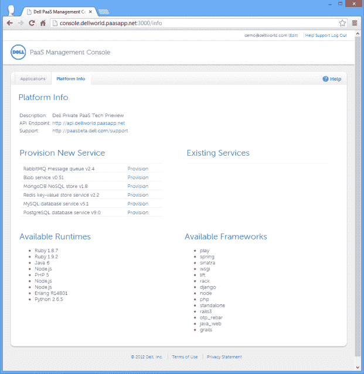

# 戴尔推出了真正有意义的新平台即服务 TechCrunch

> 原文：<https://web.archive.org/web/https://techcrunch.com/2012/12/16/dell-has-a-new-platform-as-a-service-that-actually-makes-sense/?utm_source=dlvr.it&utm_medium=feed&utm_campaign=einews>

# 戴尔有一个真正有意义的新平台即服务

戴尔有一个新的平台即服务(PaaS ),它实际上很有意义。

这项服务被称为 [Project Fast PaaS](https://web.archive.org/web/20221202235922/http://www.dell.com/Learn/us/en/555/cloud-computing/dell-cloud-computing-foundry?c=us&l=en&s=biz&cs=555) ，是新[戴尔云实验室](https://web.archive.org/web/20221202235922/http://www.dell.com/Learn/us/en/555/cloud-computing/dell-cloud-computing-labs?c=us&l=en&s=biz&cs=555)的一部分，该实验室还包括 Project Sputnik，这是一款面向开发人员的 Linux 笔记本电脑，以及开源云部署框架 Crowbar。Crowbar 最初是为了支持其“ [OpenStack](https://web.archive.org/web/20221202235922/http://content.dell.com/us/en/enterprise/by-need-it-productivity-data-center-change-response-openstack-cloud) 和 [Hadoop](https://web.archive.org/web/20221202235922/http://content.dell.com/us/en/enterprise/by-service-type-application-services-business-intelligence-hadoop) 驱动的产品而创建的

FastPaaS 和新的戴尔云实验室反映了我在戴尔世界一周感受到的一个悖论。虽然 Fast PaaS 代表了戴尔的创新，但与任何大型企业一样，它依赖于高利润的大交易，以满足大型企业的基本需求。

周二，我主持了一场[智库](https://web.archive.org/web/20221202235922/http://storify.com/Dell/dell-world-social-think-tank-enabling-innovation-i)的讨论，不幸的是，戴尔的经理们也参加了。一位顾客参加了。让我感到遗憾的是，一些戴尔经理在某些时候控制了谈话，这很不幸。但他们确实表达了一些观点，反映了这些天戴尔的真实冲突。

前 RedMonk 分析师迈克尔·科特(Michael Coté)现在是戴尔的云战略和特别项目总监，他在昨天的博客文章中总结得很好:它面临着一场真正的冲突。这是一个技术飞速发展的时代。客户希望获得最新、最棒的产品，但 IT 也需要保持一切正常运行。人们希望他们能确保电子邮件的有效性，并有所创新。这是一个不可能完成的任务。用 Coté的话说:

> 保持事情稳定可靠的思维定势(五个九的人群)不适合开发新的东西。像敏捷和 DevOps 中的快速交付周期这样的实践会有所帮助，但是在某些时候，确保稳定性和从中断中获利这两条路径是如此的不同，以至于你不能将它们完美地融合在一起…然而，这正是我们对 IT 部门的期望。

快速平台即服务是一个很好的例子，它说明了戴尔如何在制定独特战略时寻求创新，但却将其伪装成“解决方案”它很好地讲述了戴尔试图用其云战略做些什么。戴尔不想像亚马逊网络服务(AWS)一样，提供一个空白的虚拟机。它想提供解决方案。我认为这个策略是可行的。

Project Fast PaaS 构建于 Cloud Foundry 之上，Cloud Foundry 是最初由 VMware 开发的开源 PaaS，现在在 Apache 许可下运行。

PaaS 是内部部署的，是私有的。所有东西都包装好了。开发人员填写一些表格，包括编程语言、所需内存量以及应用程序要连接的数据库。这样做，一个应用程序就出来了——“你好，云！”好吧。至少当戴尔高级产品经理 Ed Conzel 在戴尔世界的演示中为我创建一个应用程序时，它是这么说的。看起来也不错。这很简单——一旦应用程序上线，它就可以监控并在需要时关闭它。而且是移动的。在演示中，我看到了应用程序如何同步到戴尔平台即服务，然后 IT 可以对其进行维护。在演示中，康泽尔部署了这款应用，云工程总监汤姆·戴维斯通过智能手机控制它。相当酷。

PaaS 适合许多解决方案。戴尔的总体愿景是在其 OpenStack 云中提供虚拟机。他们不像惠普那样以开发者为目标，而是专注于提供一个空白的虚拟机，开发者可以在此基础上进行构建。戴尔的目标是更高级别的使用案例，在这些案例中，它可能想要的不仅仅是一张白纸。这些公司希望通过计费和身份等附加服务来“SaaS”他们的应用程序。客户不想要来自多个不同供应商的账单。他们想要一个包裹。

快速 PaaS 是戴尔云故事的重要组成部分。它符合该公司的各种收购，如 Clarity，以及像 Project Sputnik 这样的本土项目:

*   Clarity 为集成开发环境(IDE)提供了一个容器。一个老派的遗留应用程序可以清晰地放置在一个容器中，并交付给 Fast PaaS。戴尔与 Salesforce.com 有经销商关系，所以旧软件变成了新世界 SaaS。
*   Project Sputniok 是戴尔在开发人员社区的帮助下为开发人员开发的 Liniux 笔记本电脑。它可以直接配置到 PaaS 中，因此开发人员可以轻松地将它与他们创建的其他概要文件一起使用。具有讽刺意味的是，这与解决策略正好相反。虚拟机整装待发，而笔记本电脑则是一张白纸。

我在戴尔世界度过了愉快的一周，对其创新感到惊讶，但也提醒了企业面临的挑战。但戴尔可能正处于正确的位置，平衡了开发者运动与 IT 现实。