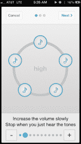

# SoundFocus 筹集了 170 万美元来调整音乐以适应你听到的方式

> 原文：<https://web.archive.org/web/http://techcrunch.com/2014/02/20/soundfocus-raises-1-7m-to-adjust-music-to-the-way-you-hear/?utm_source=dlvr.it&utm_medium=feed>

我通常喜欢写关于初创公司的文章，但我更喜欢写那些致力于不可否认对世界有益的事情的初创公司。这是其中之一。

[SoundFocus](https://web.archive.org/web/20230316050907/http://soundfocus.com/) 正在努力改善重听人或听不到特定频率的人听音乐的体验。他们刚刚筹集了 170 万美元来完成这项工作。

此轮投资者包括 Kapor Capital (Lotus 和 EFF 联合创始人米切尔·卡普尔的基金)、Y-Combinator、Greg Badros、Ovo Fund、RTA Capital、Vegas Tech Fund、Garry Tan、Alexis Ohanian 和 Harj Taggar。

我们第一次写 SoundFocus 是在 2013 年底，就在他们首次推出他们的 [iOS 应用程序之后。](https://web.archive.org/web/20230316050907/https://techcrunch.com/2013/08/14/yc-backed-soundfocus-launches-with-an-app-for-2020-hearing-with-mysterious-hardware-on-the-way/)

该应用程序兼容 iPhone 的内置音乐库和从 Spotify 下载的歌曲，可以根据一个人听到不同频率的独特能力自动调整音乐。

当你第一次启动应用程序时，一个快速的一分钟测试可以帮助你确定哪些频率你能听到，哪些不能听到。当你稍后通过应用程序播放一首歌曲时，它会相应地调整音乐。听不太清楚高音？这个应用程序将会把这些较高的频率降低到你能听到的范围内。即使你一只耳朵听到的频率比另一只耳朵好，它也能补偿。

一个人如何在这个空间中找到自己？该公司的联合创始人之一亚历克斯·塞利格(Alex Selig)从小听力受损，双耳都需要助听器。他和他的联合创始人 Varun Srinivasan 在微软的一次演出中相遇，两人开始着手，正如他们对我所说的那样，“改变世界倾听的方式”

这款应用一直都是免费的。那么团队怎么赚钱呢？

正如我们之前所写的，他们正在开发这款应用的硬件等价物，将为任何音乐源带来类似的功能——不仅仅是你的 iPhone。他们仍然没有透露这个硬件解决方案到底是什么*，但他们希望这个免费的应用程序将有助于提高长期意识(问题和他们的努力)。*

 *你可以在 App Store [找到 SoundFocus(目前仅 iOS 版)，就在这里](https://web.archive.org/web/20230316050907/https://itunes.apple.com/us/app/symphonic/id670086460)。*