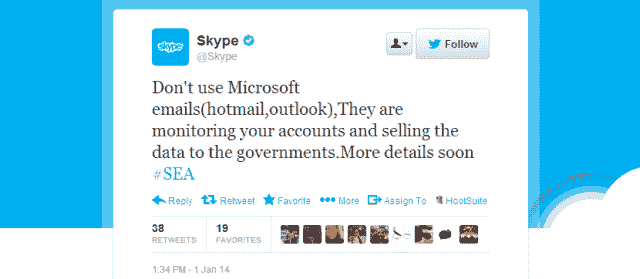
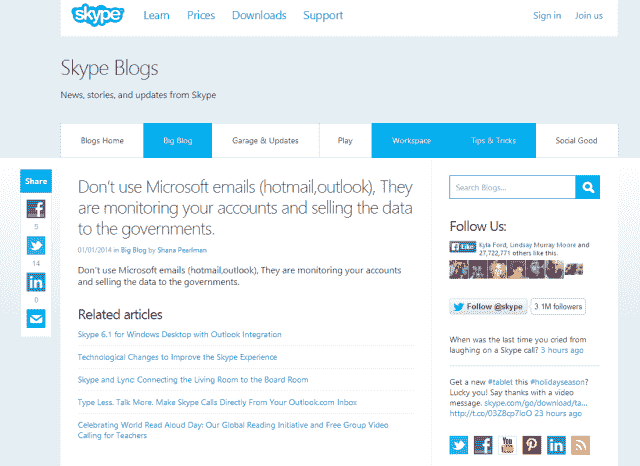
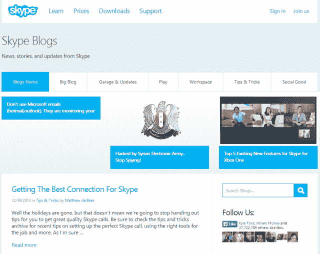

# 叙利亚电子军通过入侵 Skype 的社交媒体账户迎来了新年

> 原文：<https://web.archive.org/web/http://techcrunch.com/2014/01/01/the-syrian-electronic-army-rings-in-the-new-year-by-hacking-skypes-social-media-accounts/?utm_source=dlvr.it&utm_medium=linkedin>

# 叙利亚电子军通过入侵 Skype 的社交媒体账户迎来了新年

叙利亚电子军又来了。该组织刚刚入侵了 Skype 的博客和 twitter 账户，并在此过程中传播了反国家安全局、反微软的信息。“不要使用微软的电子邮件(hotmail，outlook)，他们在监视你的账户，并把数据卖给政府”，[一个帖子](https://web.archive.org/web/20230327054425/http://blogs.skype.com/2014/01/01/dont-use-microsoft-emails-hotmailoutlook-they-are-monitoring-your-accounts-and-selling-the-data-to-the-governments/)说。“被叙利亚电子军黑了..别再刺探了！”，[表示另一个](https://web.archive.org/web/20230327054425/http://blogs.skype.com/2014/01/01/hacked-by-syrian-electronic-army-stop-spying/)。

Skype 服务本身似乎没有受到影响。

该组织还控制了 Skype 的脸书，尽管那条消息后来被删除了。然而，这些帖子被张贴了近 40 分钟。

截至发稿时，这个激进组织似乎仍然控制着 Skype 的[博客](https://web.archive.org/web/20230327054425/http://blogs.skype.com/)和[推特](https://web.archive.org/web/20230327054425/https://twitter.com/Skype/status/418495453471068161)。

今年早些时候，有人透露，美国国家安全局可以窃听 Skype 视频通话，这彻底否定了微软此前声称该服务是安全的。然而，按照这种逻辑，在上周关于 NSA 访问范围的披露之后，SEA 可能会瞄准几乎每一家技术公司。

微软回应:

## 被黑博客的图片

