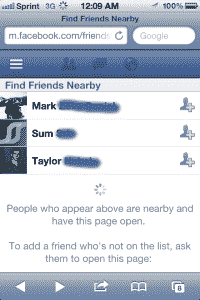

# 你在附近再也找不到朋友了:脸书推出其位置感知移动应用来添加新朋友 

> 原文：<https://web.archive.org/web/https://techcrunch.com/2012/06/25/you-wont-find-friends-nearby-anymore-facebook-pulls-its-location-aware-mobile-app/?utm_source=feedburner&utm_medium=feed&utm_campaign=Feed%3A+Techcrunch+%28TechCrunch%29&utm_content=FaceBook>

就这么多了！就像脸书周日在网上悄悄地、迅速地发布“寻找附近的朋友”一样，即时添加你附近的新脸书朋友的移动服务已经不复存在了。访问移动网页是空白的，点击 iOS 应用程序中的“查找附近的朋友”标签会进入错误页面。

当我们[昨天第一次透露关于脸书新功能的新闻](https://web.archive.org/web/20221206120106/https://beta.techcrunch.com/2012/06/24/friendshake-facebooks-new-mobile-feature-for-finding-people-nearby-and-a-highlight-killer/)时，潜在客户提出了各种各样的问题，关于脸书在这个领域可能会做什么。这款应用可以让用户找到附近的其他脸书用户，然后迅速将他们加入他们的网络:这项服务看起来非常初级，但这个概念为脸书如何发展这样的服务提供了潜在的想法。

Find Friends Nearby 利用环境移动服务的概念，根据你的位置向你提供社交信息，并提出了这与该公司最近收购的社交发现移动应用[glance](https://web.archive.org/web/20221206120106/https://beta.techcrunch.com/2012/05/04/facebook-buys-location-based-discovery-app-glancee/)有何关联的问题。这也让我们看到了脸书如何将其服务扩展到人们结识新朋友的领域，而不仅仅是加强与他们已经认识的人的联系。

而且——这一点不容小觑——它也吸引了脸书的一个主要目标——广告业的注意。我昨天在我家附近用 FFN 功能添加的一个人恰好是一家大型国际媒体购买机构(早期采用者，联合起来！).他看到了很多潜力，他说:

当我问他对这项服务的看法时，他告诉我:“我本周和脸书开会讨论了如何更有效地利用手机做广告，我认为这一发展尤其会给他们带来真正的优势，并让反对者安静一点。”。(我不想在这里指出他的名字，因为我没有事先明确使用该评论，但他的代理是一个大问题。)

开发这款应用的脸书开发者瑞安·帕特森(Ryan Patterson)昨天鼓励人们传播这款应用，他昨天甚至发布了一些关于如何使用这款应用的想法，以回应我们的故事:

“对我来说，这款产品的理想用例是，当你和一群你最近认识并希望保持联系的人一起外出时，”他写道。“脸书搜索可能会很有效，或者分享你的虚名地址或名片，但这个工具提供了一种非常简单的方式，以最小的摩擦与多人交换联系信息。”

这给我一种感觉，这可能不是我们最后一次看到 FFN，或者 Friendshake，或者 FB 决定叫它什么。

无论如何，当我们昨天就这款应用联系他们时，脸书没有做出任何承诺。一位发言人昨天晚些时候通过电子邮件告诉我，“我们正在不断测试新功能，但目前没有更多内容可以分享。”

还会有很多其他问题需要解决:例如，更多关于隐私的问题，以及你如何能够更好地过滤谁可以使用该应用联系你(例如，在黑客马拉松上，只有开发人员，而不是招聘人员；但例子不胜枚举)。

具有讽刺意味的是，这款应用消失的消息传出之际，纽约一名煽动人心的应用开发者指责脸书剽窃了该应用的创意。

Friendthem.com 是一款 iOS 和 Android 应用，它与脸书连接起来，并且——是的——让用户与身旁的人交朋友。它拥有 30，000 名用户，并促成了 20，000-25，000 个好友请求。

首席执行官 Charles Sankowich 告诉我，他就这项服务会见了“一位高管和脸书移动的主管 Henri Moissinac”。“我们至少收到了两封关于加他们为好友的邮件，”他在邮件中告诉我。他目前正在考虑是否对脸书窃取他的想法采取法律行动——尽管脸书撤掉这个功能可能会让这些计划不那么痛苦。

我们正在联系脸书，以获得关于今天开发的更全面的评论，并将随着我们了解的更多而更新，但一份给 [Wired](https://web.archive.org/web/20221206120106/http://www.wired.com/gadgetlab/2012/06/facebook-quietly-releases-find-friends-nearby-then-quietly-pulls-it/) 的声明指出:“这不是一个正式的发布——这只是一些工程师正在测试的东西。对于所有的测试，有些会作为完整的产品发布，有些则不会。目前对此没有更多要说的，但当有什么要说的时候，我们会与每个人沟通。”