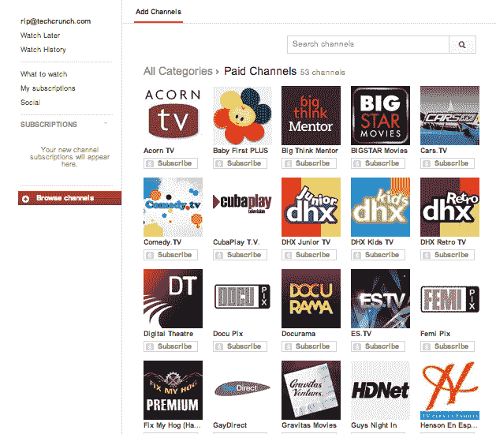

# 随着频道订阅的推出，YouTube 小心翼翼地走向付费墙，但广告在 TechCrunch 上播放

> 原文：<https://web.archive.org/web/https://techcrunch.com/2013/05/09/youtube-tiptoes-toward-paywalls-with-the-launch-of-channel-subscriptions-but-the-ads-play-on/?utm_source=feedburner&utm_medium=feed&utm_campaign=Feed%3A+Techcrunch+%28TechCrunch%29&utm_content=Netvibes>

虽然看完 YouTube 上的所有视频需要一百万次生命，但该公司依靠业余和专业合作伙伴的贡献来保持其内容的新鲜。与此同时，其核心商业模式围绕着为广告商提供触及其十亿多观众的能力。反过来，视频制作者依赖(或想要依赖)广告收入的一部分来继续制作他们的内容。当然，问题是，这些广告令人生厌，而且最终，它的合作伙伴会发现，这些横幅广告和视频片段的收入增长速度远远赶不上 YouTube 上的猫视频数量。

为了给合作伙伴提供另一种收入来源， [YouTube 今天](https://web.archive.org/web/20221206232326/http://youtube-global.blogspot.com/2013/05/yt-pc-2013.html)宣布，它将正式启动一项试点计划，使其视频明星能够对访问他们的频道收取订阅费。订阅费将从每月 0.99 美元开始，每个频道都将能够提供 14 天的免费试用，以及折扣年费。

在声明中，YouTube 引用了芝麻街和 UFC 的例子，芝麻街将通过其付费频道提供完整的剧集，UFC 为粉丝提供了观看经典打斗的能力。更多信息，这里是其 53 多个[试点频道](https://web.archive.org/web/20221206232326/http://www.youtube.com/channels/paid_channels)的列表。

截至目前，用户可以从他们的台式机和笔记本电脑上订阅付费频道，并在各种设备上观看，但未来 YouTube 将寻求增加从任何媒体/设备上订阅的能力。最重要的是，YouTube 将在未来几周内开始为“合格的合作伙伴”推出更广泛的订阅，从表面上看，它将增加一个付费频道推荐源——就像它现在对免费频道所做的那样。

如果你没有 YouTube 频道，你为什么要在乎呢？好吧，YouTube 已经有一段时间了，但这确实是 YouTube 开始悄悄进入付费视频市场的第一个(官方)迹象。诚然，订阅模式对 YouTube 来说并不是一个新想法，考虑到公司[在三月](https://web.archive.org/web/20221206232326/https://beta.techcrunch.com/2013/03/05/youtube-to-launch-music-subscriptions/)刚刚宣布它将在今年晚些时候推出音乐订阅服务。

目标是一样的:给音乐人/艺术家/创作者一个赚钱的机会，同时通过潜在地删除每一个视频开头的一些讨厌的广告来改善听众的用户体验。当然，就视频和音乐而言，YouTube 更有可能两者都坚持下去。

业余内容创作者将对围绕他们的内容建立付费墙犹豫不决。大多数观众会对购买 YouTube 频道订阅的想法犹豫不决，还有一个问题是，他们是否真的能够将足够多的观众转化为付费订阅，从而使其物有所值。最后，这也是报纸和出版商多年来一直纠结的问题。

还有一个事实是，每个视频制作者都已经在免费提供他们的内容，尽管是在广告背后。现在你要告诉观众，他们必须为一直免费获得的相同内容付费？当然，这对你的超级粉丝来说是可行的，但就像“免费增值”模式一样，如果你要收费，付费墙后面的内容最好是优质的。我想看“临时演员”，独家内容/镜头，等等。

当然，正如彼得·卡夫卡本周指出的那样，业余视频制作人可能没有资源来制作独家或优质内容。

【T2

尽管如此，该公司将使用付费订阅来吸引新的合作伙伴、新的内容创作者，我们认为，还会有更多的美元——尽管 YouTube 没有说明它是否会收取订阅费。YouTube 清楚地意识到 Hulu、网飞、Vimeo 和其他视频网站在订阅和点播模式方面取得的成功，它希望对电影和电视网络、工作室和制作人更具吸引力。

但就目前而言，YouTube 不能完全转向订阅，因为它需要那些广告资金来维持整个业务。毫无疑问，这是一条很难走的路，但在可预见的未来，YouTube 肯定不会通过建立付费墙和视频广告来帮助用户体验。

就我个人而言，我可能最经常使用 YouTube 进行搜索(和一点发现)，尤其是关于音乐的搜索。换句话说，我想到一首歌或一位艺术家，就会在 YouTube 上搜索，这不可避免地会为同一首歌、艺术家甚至主题提供几个或几十个选择。我很可能不知道哪个视频是我想要的或者是最好的，这需要仔细阅读，所以在每个视频的开头放一个 10 秒钟的广告真的很有破坏性。

也许这是一个利基用例，但我怀疑不是。YouTube 广告虽然可以容忍，因为我们有意识或下意识地认识到它们在保持数百万猫视频在线播放中的作用，但却令人沮丧。当然，Hulu 也有广告，它们也好不到哪里去。但至少在 Hulu 的情况下，观众知道他们正在在线观看 30 分钟或 1 小时的电视节目，而常规的老式离线电视已经让我们习惯于每 5 秒钟就有广告。不幸的是。但是对于一个质量可疑的 2 分钟短片？走吧。

因此，保留广告，同时慢慢建立付费墙是一个坏主意。因此，付费视频的推出最终将是渐进式的，几乎只是一种善意的展示——以避免惹怒他人——而广告只会继续激增。