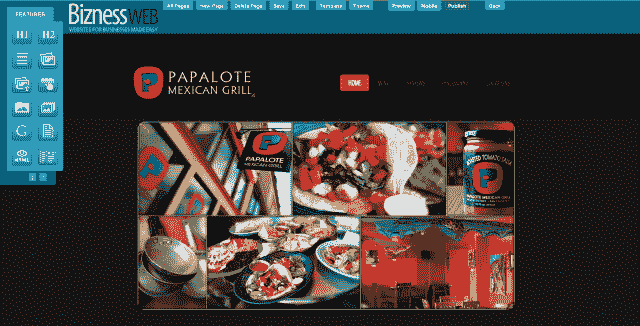
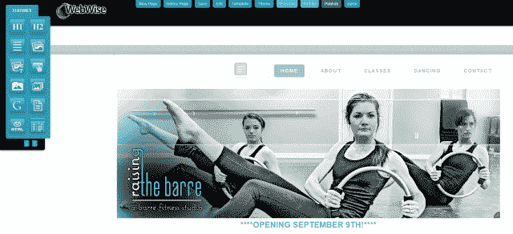
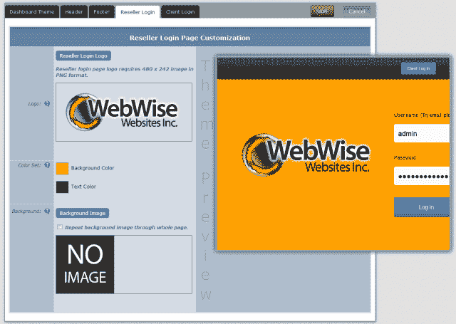

# Bizness Apps 推出 DIY 网站构建器，希望成为面向中小企业的全方位数字营销套件 

> 原文：<https://web.archive.org/web/http://techcrunch.com/2013/09/28/bizness-apps-launches-diy-website-builder-looks-to-become-a-full-service-digital-marketing-suite-for-smbs/?utm_source=feedburner&utm_medium=feed&utm_campaign=Feed:+techcrunchIt+(TechCrunch+IT>)

曾几何时，如果你想要一个自己的网站，你要么说一口流利的互联网，要么给一个愿意的人开一张大额支票。然而，多亏了过去五年涌现出的一系列公司和服务，比如 Weebly、Wix 和 Squarespace 等等，建立一个时髦网站的障碍已经消失了。今天，网站创建者是自由的，唯一需要的技术技能是定位互联网的能力。

如今，随着智能手机充斥市场，类似的故事正在应用程序开发中展开。随着客户走向移动化，企业也渴望这样做。一系列服务应运而生，以满足日益增长的需求，为企业提供了一种快速简便的方式来为 iOS、Android 及其他系统创建应用。[2010 年推出的 Bizness Apps](https://web.archive.org/web/20230129215119/http://www.biznessapps.com/) 正是为了做到这一点，它为公司提供了一种低成本的方式来构建自己的移动应用和网站，而无需知道如何编码。

但是，对于 DIY 网站建设者来说，有如此多的选择，包括移动和桌面，如果他们想要脱颖而出，生存下去，这些服务必须从竞争中脱颖而出。因此，许多人选择专业化，提供与其他人相同的基本功能，同时专注于增加更多功能和价值，比如社交网络、传单制作或购物。

[像 SnapPages](https://web.archive.org/web/20230129215119/https://techcrunch.com/2013/07/09/snappages-takes-aim-at-the-wixes-and-weeblys-of-the-world-with-major-new-redesign/) 一样，为了在这个拥挤的市场中脱颖而出，Bizness Apps [开发了一个白色标签程序](https://web.archive.org/web/20230129215119/https://techcrunch.com/2012/01/23/does-your-business-need-mobile-apps-bizness-apps-more-give-you-the-premium-tools/)，允许公司和企业为他们现有的客户或当地的中小企业开发移动应用。此后不久，初创公司[增加了一个 CRM 平台](https://web.archive.org/web/20230129215119/https://techcrunch.com/2012/10/05/the-14-most-interesting-startups-to-emerge-from-demo/)，以帮助其白标经销商向初创公司和其他中小企业销售应用程序和网站，今天，Bizness Apps 正在添加最后一块拼图。

这家初创公司今天推出了自己的拖放式 DIY 网站构建器[，名为 Bizness Web](https://web.archive.org/web/20230129215119/http://www.biznessweb.com/) ，这是一个旨在完善其自助开发套件并将其带入 Weeblys、Wixes 和 Squarespaces 领域的平台游戏。

创始人兼首席执行官 Andrew Gazdecki 表示，网站创建服务将允许中小企业在 10 分钟内快速设计并发布一个适用于桌面、智能手机和平板电脑的全功能网站，而无需考虑技术技能。为了向企业提供可与其竞争对手相媲美的功能集，该网站建设者将提供一个包含数百个模板的库，旨在使其易于入门，以及 SEO 工具、发布后编辑功能、社交媒体集成、定制联系人和销售线索表单创建和分析。

【T2

新产品意图采取类似于其白标经销商计划的战略和重点，该计划为公司和个人提供推出自己的移动营销业务和开发移动应用程序和移动网站的能力，这些应用程序和网站可以根据客户的偏好进行定制和品牌化。白标转售工具允许这些弹出式应用程序开发企业设定自己的价格，并为他们当地的小型企业市场提供开发应用程序的服务。

这位首席执行官告诉我们，经销商计划也是公司最赚钱的产品，为公司带来了大部分收入。这家初创公司在推出后筹集了 10 万美元的小规模种子资金，但此后一直在自举，现在由于经销商驱动的 800 万美元的年运营率而盈利，该公司预计到今年年底将达到 900 万美元。

但是，是什么让首席执行官认为其新的 DIY 网站建设者将找到一个观众，并能与最受欢迎的服务竞争，这些服务今天在市场上占主导地位？Gazdecki 说，他认为小型企业市场分为两部分，一部分愿意使用 DIY 营销工具，另一部分则愿意支付额外费用，正如他们所说的那样，“雇佣专业人员”。

虽然 Weebly 和 Wix 主要专注于前者，但这位首席执行官表示，Bizness Apps 希望利用其现有的经销商网络，为移动和网站开发提供更实用的方法，即使这需要收取更高的价格，因此有可能失去寻找免费 DIY 选项的机会。此外，他说，即使公司处于一个“极其拥挤的市场”，58%的小企业仍然没有网站，主要原因是他们缺乏建立自己网站的信心。

其核心是，Bizness Apps 的使命是让任何人都可以创办自己的本地营销公司，并通过其三个主要产品帮助本地企业上网、移动化和管理客户。“最终，我们发现小企业更愿意将营销服务嵌入这种平台，”这位首席执行官告诉我们，“即使这意味着支付额外的费用。”

如今，该公司在全球拥有 5，000 家活跃的经销商，来自 50 多个国家，提供数十种语言的服务。正如其经销商计划旨在通过向客户提供学习如何营销其业务以及如何接近和销售给小企业的能力来解决相关痛点一样——除了提供品牌应用程序和网站——展望未来，Gazdecki 希望包括更多功能，帮助客户从平台中获得更多价值。

它的经销商经常根据市场和客户添加定制功能，如移动订餐系统、支付网关和餐馆菜单集成，这样他们就不必在收据打印机集成等方面摸索。这位首席执行官表示，他希望新的网站建设者能够整合在线订餐、预订和电子商务工具等功能。

该公司为每个平台提供每月 59 美元的原创 DIY 应用程序产品，包括原生 iPhone 应用程序、Android 应用程序、iPad 应用程序、Android 平板电脑应用程序和移动网站，并将根据三级定价方案销售其网站生成器，根据其“小型企业”选项，每月 10 美元起。其业务层将每月 100 美元，包括 10 个网站、营销材料、销售培训和一个免费的 Bizness CEM 账户，而其“白标经销商”计划包括所有之前的选项，有能力创建无限数量的网站。

更多关于商业网站的信息，请点击这里。

【T2