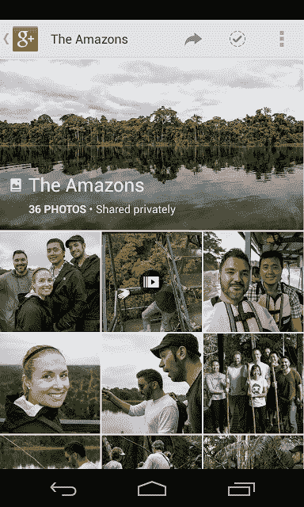
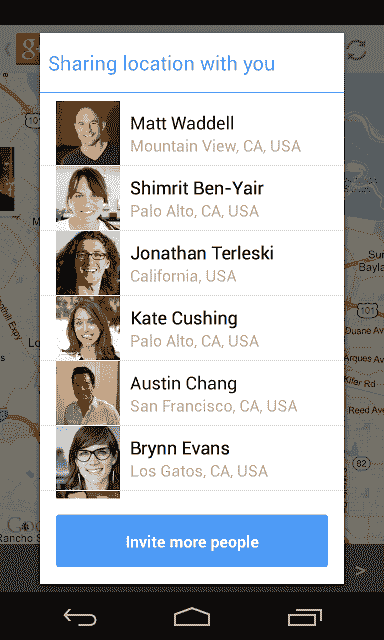

# Google+获得 Android 更新，以反映其 I/O 的 41 更新盛会，添加新的位置部分 TechCrunch

> 原文：<https://web.archive.org/web/https://techcrunch.com/2013/05/20/google-gets-a-refresh-for-android-to-mirror-its-41-update-extravaganza-from-io-adds-new-location-section/?utm_source=feedly&utm_medium=feed&utm_campaign=Feed%3A+Techcrunch+TechCrunch>

# Google+对 Android 进行了更新，以反映其 I/O 的 41 更新盛会，添加了新的位置部分

今天，谷歌[更新了 Android](https://web.archive.org/web/20221005173246/http://googleplusproject.blogspot.com/2013/05/google-for-android-42.html) 的 Google+应用程序，以跟上上周 I/O 开发者大会上宣布的所有变化。总共有 41 个新的更新，包括一个[新流](https://web.archive.org/web/20221005173246/https://beta.techcrunch.com/2013/05/15/google-redesigns-its-stream-to-include-multi-column-google-now-esque-cards-auto-hashtags-and-more/)、[照片体验](https://web.archive.org/web/20221005173246/https://beta.techcrunch.com/2013/05/15/google-photos-can-now-automatically-create-animated-gifs-panoramas-hdr-images-and-better-group-shots/)和 [Hangouts](https://web.archive.org/web/20221005173246/https://beta.techcrunch.com/2013/05/15/google-hangouts-messaging-app/) 。

Android 版本拥有所有这些，还有一个新功能——一个新的位置部分。

Anroid 应用程序真正的亮点是照片功能。更新后的 Google+应用程序现在具有桌面版本所具有的自动备份、高亮显示、增强和“自动赞”功能。直接在应用程序中增强照片真的很方便，而不是等到回到电脑前或依赖谷歌进行神奇的合成除皱，尽管这很酷。

为了让“制定计划和会面”变得更容易，Google+将“地点”分成了自己的部分。现在，当你与某些圈子分享你的位置时，你的朋友可以通过点击该部分很容易地找到你。很自然地，它将每个人的位置放在地图上，这使得它无缝:

到目前为止，位置并不是 Google+的一大亮点。该服务目前会获取你的位置，并要求你提供明确的位置，而不是告诉你谁会看到它。有了位置部分和控件，它更容易管理，可以变成类似于 Foursquare 的体验。

该流也获得了上周的所有特性。自动标签会让你钻取新的内容，希望能吸干你所有的空闲时间。它把 Google+的体验变成了类似维基百科的东西，在那里你可以不断点击相关内容，并有希望找到一些新的人跟随。虽然你不会在你的智能手机上得到新的三列布局，但向下钻取实际上很有趣。

我们将等待 iOS 的更新，但希望相同的项目能在该版本中找到自己的方式。所有这些改进都是为了吸引你在 Google+中做更多的事情，因为该公司并不真的希望你从一个网络跳到另一个网络。在这次更新中，这些功能更加互补，为新用户提供更好的体验，这是谷歌目前最重要的人口统计。我们这些尝试过 Google+的人已经对它是否有用拿定了主意。需要啧啧称奇的是那些从一开始就没看出来的散兵游勇。