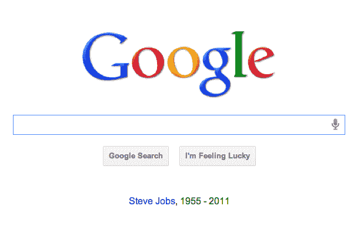
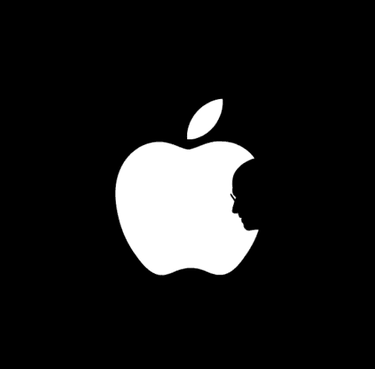

# 全世界都在纪念史蒂夫·乔布斯 

> 原文：<https://web.archive.org/web/http://techcrunch.com/2011/10/06/put-a-dent-in-the-universe/?utm_source=pulsenews&utm_medium=referral&utm_campaign=Feed%3A+Techcrunch+(TechCrunch>)

> 如果你把每一天都当作最后一天来过，总有一天你会发现自己是对的这件事给我留下了深刻的印象，从那以后，在过去的 33 年里，我每天早上都会对着镜子问自己:‘如果今天是我生命的最后一天，我会想做我今天将要做的事情吗？’每当答案连续很多天都是“不”的时候，我知道我需要改变一些东西。 **—乔布斯**
> 
> *“大多数人过着平静绝望的生活。”* **—亨利·大卫·梭罗**
> 
> 相信你自己的想法，相信在你内心深处对你来说是真实的对所有人来说也是真实的，这就是天才 **—拉尔夫·瓦尔多·爱默生**

史蒂夫·乔布斯引用的东西是，从概念上讲，他从来没有真正说过亨利·大卫·梭罗(或者爱默生或者尼采)没有说过的关于自力更生的话，但是他设法为现代主流消费包装得非常好。他让超验主义哲学这样复杂的东西为大众所接受的巧妙方式，反映了他将个人电脑带给大众的方式，即让所有人都可以使用电脑。

如果我们每个人醒来时都在想:“如果今天是我生命的最后一天，我会整理 Excel 电子表格，或者做任何琐碎的事情吗？”正如我之前说过的，我可能会在某个海滩上，而不是写这篇文章或任何帖子。

在他著名的斯坦福大学毕业典礼演讲中，乔布斯解释说，如果答案是“不”的时间太长，这是一个改变方向的信号；唯一的问题是，我们大多数人不会马上知道答案是“是”还是“不是”。我们能想到的最好的回答是一个软弱的“我不知道”

但是，即使我们在读完他的文字后没有辞职或搬走或开始创业或立即休假，史蒂夫·乔布斯也要求我们尝试一些似乎比我们目前的单调更有趣的东西，在我们日常生活的界限内进行实验，看看是否还有更多。

由于这种影响，我们中的许多人决定在他去世后的第二天去表达我们的敬意，以替代的方式成为史蒂夫·乔布斯生活的一部分，并为他的遗产做出贡献——无论是通过将我们的 Twitter 头像改为彩虹苹果，还是在我们的博客上写个人悼词，回答 Quora 的问题，设立[史蒂夫·乔布斯日](https://web.archive.org/web/20230203062309/http://stevejobsday2011.com/)(!)或者用幽默来处理损失(我朋友的 Macbook 死机了，她告诉苹果店的天才，电脑很可能生病了，因为它爸爸已经去世了)。

这里收集了我最喜欢的与史蒂夫·乔布斯相关的在线和离线纪念

[巴拉克·欧巴马](https://web.archive.org/web/20230203062309/http://www.whitehouse.gov/blog/2011/10/05/president-obama-passing-steve-jobs-he-changed-way-each-us-sees-world):“世界上很多人通过史蒂夫发明的设备得知了他的死讯，这可能是对他成功的最大褒奖了。”

这张 Instagram 是苹果设计师约翰·曼扎里(T7)拍摄的乔布斯离开工作岗位的照片。

这是 Gizmodo 的 Brian Lam 发的“史蒂夫·乔布斯总是对我很好(或者说，是一个混蛋的遗憾)”。

这些照片由 Push Pop Press 联合创始人[迈克·马塔斯](https://web.archive.org/web/20230203062309/https://www.facebook.com/mikematas)发布。

史蒂夫·乔布斯讲述“不一样的思考”广告的未播出视频。

http://www.youtube.com/watch?v = 8 rwsuxha 7 ra & feature = player _ embedded

各苹果商店的便利贴。

洋葱的[“最后一个知道自己在做什么的美国人死了。”](https://web.archive.org/web/20230203062309/http://www.theonion.com/articles/last-american-who-knew-what-the-fuck-he-was-doing,26268/)

史蒂文·利维的[“史蒂夫·乔布斯，1955 — 2011。”](https://web.archive.org/web/20230203062309/http://www.wired.com/epicenter/2011/10/jobs/)

Cnet 的[“如何在 iOS 上获得苹果 logo 图标。”](https://web.archive.org/web/20230203062309/http://howto.cnet.com/8301-11310_39-20116414-285/how-to-get-the-apple-logo-icon-on-ios/)

《连线》杂志的[“这些东西不会改变世界”:残疾和史蒂夫·乔布斯的遗产](https://web.archive.org/web/20230203062309/http://www.wired.com/epicenter/2011/10/steve-jobs-disability/)

xkcd 的[永恒火焰](https://web.archive.org/web/20230203062309/http://xkcd.com/961/)(恰好是我喜欢过的为数不多的 xkcd 之一)。

BoingBoing 的重新设计。

苹果自己的极简/极大化致敬。

约翰·格鲁伯的[脏运动鞋类比](https://web.archive.org/web/20230203062309/http://daringfireball.net/2011/10/universe_dented_grass_underfoot)。

[解封的](https://web.archive.org/web/20230203062309/http://www.uncrunched.com/) [改版的](https://web.archive.org/web/20230203062309/http://daringfireball.net/2011/10/universe_dented_grass_underfoot)。

Mint Digital 在 MacBook Pro 零件中的[人像。](https://web.archive.org/web/20230203062309/http://foundry.mintdigital.com/post/11104229347/a-tribute-to-mr-steve)

这个 iOS 拼写检查照片迷因。

沃尔特·莫斯伯格:[“我认识的乔布斯](https://web.archive.org/web/20230203062309/http://allthingsd.com/20111005/the-steve-jobs-i-knew/)[”](https://web.archive.org/web/20230203062309/https://techcrunch.com/wp-content/uploads/2011/10/screen-shot-2011-10-06-at-5-05-37-pm.png)

谷歌主页(“史蒂夫·乔布斯”链接回苹果主页)。

解决方法是[“思考不同”和迷幻药。”](https://web.archive.org/web/20230203062309/http://www.thefix.com/content/steve-jobs-think-different-and-lsd)

沃兹记得他的伙伴和朋友。

哦，亚马逊主页，你做错了。

乔布斯的邻居李森·斯特罗姆贝里:[“我的邻居史蒂夫·乔布斯。”](https://web.archive.org/web/20230203062309/http://paloalto.patch.com/articles/my-neighbor-steve-jobs)

建筑师诺曼·福斯特爵士:[“对史蒂夫·乔布斯的赞赏。”](https://web.archive.org/web/20230203062309/http://archrecord.construction.com/news/2011/10/Steve-Jobs.asp)

设计师乔纳森·麦的史蒂夫·乔布斯/苹果[图标。](https://web.archive.org/web/20230203062309/http://jmak.tumblr.com/post/9377189056)

“10 年前，我们有史蒂夫·乔布斯、鲍勃·霍普和约翰尼·卡什——现在我们没有工作，没有希望，也没有现金。”/via [Reddit](https://web.archive.org/web/20230203062309/http://www.reddit.com/r/reddit.com/comments/l2y30/10_years_ago_we_had_steve_jobs_bob_hope_and/) 。

孩子们在乔布斯家外面的人行道上写作。

 史蒂夫和比尔/via [Quora](https://web.archive.org/web/20230203062309/http://www.quora.com/What-types-of-graphic-tributes-to-Steve-Jobs-are-being-shared-in-your-network) 。

用 Mac 产品制作的乔布斯肖像/via [Quora](https://web.archive.org/web/20230203062309/http://www.quora.com/What-types-of-graphic-tributes-to-Steve-Jobs-are-being-shared-in-your-network) 。

# 

[“史蒂夫·乔布斯不是上帝。”](https://web.archive.org/web/20230203062309/http://gawker.com/5847338/steve-jobs-was-not-god)

[“埃里克·施密特谈史蒂夫·乔布斯。”](https://web.archive.org/web/20230203062309/http://www.businessweek.com/magazine/eric-schmidt-on-steve-jobs-10062011.html)

《天堂的高领款》/via [Matt Drance](https://web.archive.org/web/20230203062309/https://twitter.com/#!/drance) 。

乔治·卢卡斯:“史蒂夫的魔力在于，当其他人只是简单地接受现状时，他看到了他所接触的一切事物的真正潜力，并且从不在这一愿景上妥协。他留下了一个不可思议的家庭，留下了一份将在未来几年继续影响人们的遗产。”

[“史蒂夫·乔布斯 30 岁生日”](https://web.archive.org/web/20230203062309/http://technologizer.com/2011/10/06/steve-jobs-birthday-video/)

通过[法尔哈德·曼朱](https://web.archive.org/web/20230203062309/https://twitter.com/#!/fmanjoo/status/121970469523046401)向微软降半旗。

