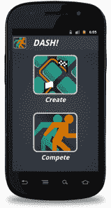

# 离开沙发:Explorence 想把你的户外活动变成互动视频游戏(邀请)

> 原文：<https://web.archive.org/web/http://techcrunch.com/2011/10/07/off-the-couch-explorence-launches-to-turn-your-outdoor-activities-into-interactive-video-games-invites/?utm_source=telecious&utm_medium=twitter>

一些创业公司和应用程序([比如 Joypad](https://web.archive.org/web/20230204140038/https://techcrunch.com/2011/10/03/joypad-turns-your-iphone-into-a-remote-control-launches-new-sdk-to-bring-ios-gaming-to-apple-tv/) 和 [Brass Monkey](https://web.archive.org/web/20230204140038/https://techcrunch.com/2011/06/02/brass-monkey-acquires-emotely-to-help-turn-your-smartphone-into-remote-controls/) 等等)正在把你的 iPhones 变成可定制的游戏控制器，而 Wii 和 Kinect 通过它们的动作感应控制台把你变成了控制器。

你已经听过几百遍了，但智能手机技术正以惊人的速度发展。五年前，视频录制还是一件新鲜事。[现在，我们的手机可以理解人类语言，进行预订，并告诉我们新衬衫让我们看起来很胖](https://web.archive.org/web/20230204140038/https://techcrunch.com/2011/10/04/apple-reveals-siri-voice-interface-the-intelligent-assistant/)。手机游戏在过去几年里也发展迅速，但大多数严肃的游戏仍然是通过浏览器或家庭控制台等完成的。，所有的游戏玩家都可以将他们的游戏带到户外。

乘着智能手机创新的高峰，并被视为让游戏玩家离开沙发的一种方式，一家新的创业公司今天开放了名为 [Explorence](https://web.archive.org/web/20230204140038/http://www.explorence.com/) 的私人测试版，该公司正在为 Android 开发户外移动游戏，很快将为 iOS 开发。

 什么意思？简而言之，通过其移动应用程序，Explorence 计划将你的户外娱乐活动转变为互动视频游戏。这家初创公司希望把你的慢跑变成“惊人的比赛”，把你的自行车骑进马里奥赛车。用户创建自己的课程和体验，与朋友异步竞争。Explorence 通过音乐、检查点、排行榜、奖励以及“失败条件”来增强这些户外活动，为您的户外娱乐创造身临其境的游戏体验。

比如 DASH！这是该初创公司使用其技术创建的第一个游戏，使用户能够创建、参与和押注任何类型的比赛(异步)。首先，用户通过 GPS 创建一场比赛，用智能手机在赛道上行走或选择起点和终点。然后，用户可以选择他们希望在这场比赛上下注多少虚拟货币——在这一点上，任何在应用程序上选择这场比赛的人都可以参加这场比赛，无论是现在还是将来。

一旦你准备好出发，应用程序将开始倒计时，一声枪响，你开始跑步(手机放在口袋里可能是个好主意)。在你的比赛中有音乐伴奏和音效，一旦你越过你创造的终点线，手机会停止计时，并自动将你的时间输入到它的虚拟排行榜上，这样你就可以看到你和你的朋友相比做得如何。

参赛者因参与而获得硬币(以及更多的胜利)，这些硬币稍后可兑换成游戏增强功能和真实世界的商品。破折号！适用于任何比赛项目:驾驶、骑自行车、跑步、单板滑雪等。

在过去的两个月里，Explorence 团队一直在测试这些时移比赛，其一小部分用户已经平均每天 3.9 次会话(比赛或创建的比赛)。对于热爱户外的游戏玩家来说，它似乎有可能变得相当上瘾。

Explorence 的技术和用户体验的关键在于团队如何能够使用 GPS、智能手机传感器等。调整特定点周围的地理围栏。例如，Explorence 还有两个产品正在开发中，其中一个将把它的技术引入极限运动，例如滑雪板运动员将能够把他们的手机放在口袋里，进入公园进行跳跃和特技。这些应用程序将测量距离、旋转量等。，一直给他们积分和配乐。

已经有一些增强现实第一人称射击游戏(FPS)出现，它们本质上是把你的智能手机变成枪，让你向你的朋友开火。当然，这项技术仍在发展中，但我们现在显然正处于功能准备成为主流的阶段。用户是否准备好接受——那是另一个故事了。

Explorence 团队由迈克·苏普罗维奇、比尔·格莱姆和马克·汤普森组成，他们都是圣地亚哥创始人学院的毕业生。

今天，达什！在 Android 上有私人测试版(今年晚些时候将在 iOS 和 Android 上推出)，Explorence 为其测试版提供 500 个邀请，读者可以通过访问该初创公司的网站并在“访问代码”栏中输入“TechCrunch”来利用[。](https://web.archive.org/web/20230204140038/http://www.explorence.com/)

检查一下，让我们知道你的想法。

http://www.youtube.com/watch?v=Q-YLgfN-OuA