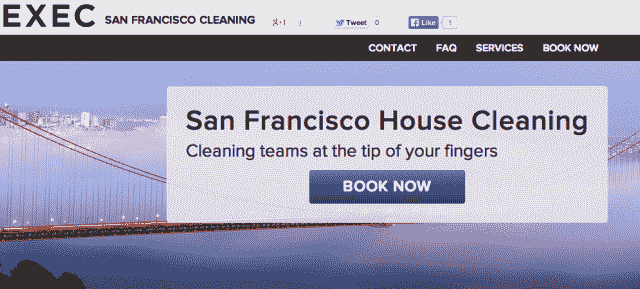

# Handybook 以“不到 1000 万美元”的价格收购 Exec，横扫家庭服务市场 

> 原文：<https://web.archive.org/web/https://techcrunch.com/2014/01/15/handybook-sweeps-up-exec-for-under-10m-to-expand-west-coast-footprint/?via=indexdotco>

贾斯汀·坎(Justin Kan)在 2012 年初推出了[Exec](https://web.archive.org/web/20221005190923/https://iamexec.com/)[，作为一项为企业提供的按需跑腿服务](https://web.archive.org/web/20221005190923/https://beta.techcrunch.com/2012/03/26/exec-justin-kan-corporate-accounts/)，但随着时间的推移，它演变成了一项清洁服务，专注于其最受欢迎的产品。由于无法扩展“差事”并努力寻找出路，这家初创公司在 9 月份关闭了其个人助理[服务](https://web.archive.org/web/20221005190923/https://beta.techcrunch.com/2013/09/10/rip-lazy-times/)，随后在其 9 个市场的[降低了家庭清洁服务的价格](https://web.archive.org/web/20221005190923/https://beta.techcrunch.com/2013/10/01/exec-price-cut/)。

几个月来，关于 Exec 试验的传言一直在流传，因为这家初创公司发现自己在日益拥挤的按需清洁市场上逆流而上，与快速增长的服务竞争，如 [Homejoy](https://web.archive.org/web/20221005190923/https://www.homejoy.com/) 、 [MyClean](https://web.archive.org/web/20221005190923/https://www.myclean.com/) 和 [Handybook](https://web.archive.org/web/20221005190923/http://www.handybook.com/) 。如今，这些传言似乎得到了证实，因为 Exec 已经选择加入竞争对手的行列，而不是单干。如果你不能打败他们，就像他们说的，加入他们。

在联合创始人兼首席执行官 Oisin Hanrahan 所说的“多家公司和家庭服务品牌之间的竞争性招标过程”之后，Handybook 今天早上宣布，它已经胜出，完成了对 Exec 的收购，这将使这两个按需家居装修和清洁品牌强强联手。

据两家公司称，在一笔价值“不到 1000 万美元”的股权交易中，Exec 将继续在西海岸市场运营，但以 Handybook 品牌命名。联合创始人贾斯汀·坎(Justin Kan)、丹尼尔·坎(Daniel Kan)和阿米尔·加兹维年(Amir Ghazvinian)将继续担任顾问角色——贾斯汀·坎提供“战略顾问”——而 Handybook 联合创始人汉拉汉(Hanrahan)和乌芒·杜瓦(Umang Dua)将继续担任新公司的首席执行官。

但是，考虑到这个领域的竞争，为什么 Handybook 能够赢得 Exec 的竞标呢？汉拉汉告诉我们，在这个领域的所有公司中，Exec 最终选择 Handybook 的主要原因是它能够提供最大的潜在协同效应——特别是在市场份额方面。

Handybook 于 2012 年 6 月推出，旨在帮助人们找到更好、更值得信赖的专业人士来满足他们的家庭需求，目前在美国 13 个市场运营按需清洁和家庭服务。然而，Handybook 最强劲的市场传统上是在东海岸和中西部，因为它成立于(现在总部位于)纽约。

相比之下，尽管 Exec 自 9 月份以来已经在 9 个市场开展业务，但它在西海岸的渗透力度最大，尤其是在洛杉矶和旧金山。汉拉汉表示，通过收购 Exec，Handybook 现在能够将其服务带到新的社区，并扩大其在西海岸的足迹，Exec 目前在西海岸为加州四个最大的城市提供服务——旧金山、圣地亚哥、洛杉矶和圣何塞。

他说，此次收购使 Handybook 能够创建一个“拥有双海岸中心的品牌”，并利用 Exec 在其本土的影响力，将使 Handybook 能够在今年晚些时候在圣莫尼卡开设其第一个洛杉矶办事处。

据报道，收购价格不到 1000 万美元，这对 Exec 来说并不是一个大胜利，迄今为止，Exec 已经从 CrunchFund、SV Angel 和 Y Combinator 等投资者那里筹集了 330 万美元。然而，如果 Handybook 能够继续以目前的速度增长，并成为市场领导者，那么高管联合创始人现在在 Handybook 中的股权可以抵消任何长期损失。

对于 Handybook 来说，收购 Exec 使其能够增加一个公认的品牌，并显著扩大其在西海岸的足迹，使其能够更好地与快速增长和资金充足的 Homejoy 竞争。该公司在 2013 年扩张到五个新的城市，并在今年秋天推出了新版本的移动应用程序，这使得该产品非常需要与所有 iOS 设备兼容。

简而言之，该公司的网络和移动服务旨在简化预订清洁和维修服务的流程，将流程精简为三个步骤。用户选择他们喜欢的服务，确认他们希望清洁工或修理工到达的时间，然后输入他们的电子邮件地址。

与 Homejoy 和其他公司一样，Handybook 的方法旨在利用对按需服务日益增长的需求——特别是清洁服务——以及人们越来越容易拿出移动设备来寻找、发现书籍和评价这些类型的家庭服务。然而，Handybook 最初是作为按需个人助理服务推出的，它真正的吸引力在于它与该领域大多数初创公司的主要区别。虽然许多人只关注清洁，但 Handybook 允许用户预订各种家庭服务。

这家初创公司不仅提供家庭和办公室清洁服务，还可以预订勤杂工、管道工和电工，但它也允许用户预订整个家庭装修类别的独特请求。此外，虽然 Exec 从未专门致力于促进屡获殊荣的家居装修，但其类似于 TaskRabbit 的起源使其创始人和团队在 Handybook 寻求扩大其按需服务覆盖范围时可能对其有用。

尽管 Exec 创始人贾斯汀·坎(Justin Kan)表示，清洁已经“在运营几个月后，在收入方面比其跑腿业务更有影响力”，并且在“跑腿”关闭时占了 90%至 95%的使用量，但后者是他最喜欢的业务之一。

然而，“跑腿”是用户必须“努力使用”的东西，因为客户必须“创造性地想出通过让别人为他们做事来节省自己时间的方法。”此外，除了创始人和工程师之外，潜在客户很难进入这种思维模式，他告诉我们，尽管人们最初喜欢这个想法，但它并没有坚持下来。

但对于 Handybook，Kan 表示，对话始于大约 8 个月前，最初是为了寻求建议，但后来，在看到他们“在用户获取和商业模式方面走得相当远”后，他们很快开始考虑收购。在这个过程中，Kan 向创始人提供了建议，他说，对企业家来说，诚实面对自己并确定自己的优势所在以及核心竞争力之外的东西非常重要。

“对我们来说，”他说，“我们相信我们在 Exec 上做得很好，但如果我们加入 Handybook，增长可能会大大加快。”最终，当菅直人和他的联合创始人不得不“在努力追逐和复制竞争对手已经完成或被收购的一些事情之间做出决定时，这个决定变得更加清晰。”

最终，尽管 Kan 是 Homejoy 的投资者，是 Y Combinator 的种子投资者，但他觉得 Handybook 比《YC 毕业生》更适合 Exec，因为它“找到了交叉销售服务，”他说。这是一条艰难的道路，要说服顾客不仅从电话或网络上购买清洁用品，更不用说说服他们预订维修和电气工作、管道服务等等。Kan 说，最终，Handybook 比其他公司更清楚这一点。

迄今为止，Handybook 已经从 General Catalyst Partners、Highland Capital Partners 和 TechStars 联合创始人大卫·蒂施(David Tisch)等人那里筹集了 1200 万美元的资金。在 Exec 的带领下，这家初创公司现在必须走出去，实现它的承诺，不仅要与清洁服务公司竞争，还要颠覆家庭服务行业，并有可能颠覆像 Angie's List 这样的巨头。